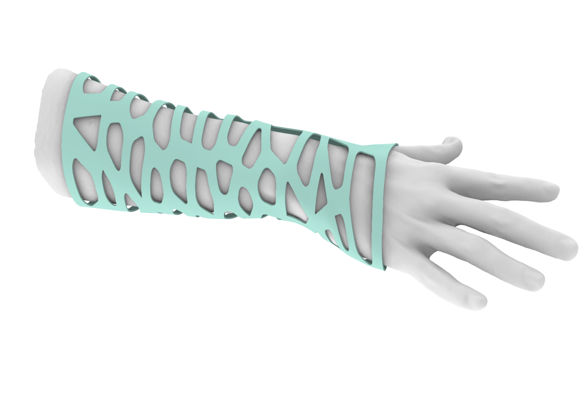

# Morphing a Pattern to a Surface

Created: April 28, 2023 4:05 PM
Tags: 3d scans, personalized
Categories: Mini-Lesson
Review: WIP - For Later

# 📑A.4 Generating Custom Pattern

<aside>
📌 *What:*         Design approach for generating a custom pattern
*For Whom:* Intermediates in Rhino/Grasshopper
*Time:          30* minutes

</aside>

In this section, we will show you how to create a custom pattern to apply on the surface of the splint. Custom patterns can be generated for aesthetics or functional needs. Custom patterns for aesthetic needs provide visually interesting designs for the customer. On the other hand, custom patterns for functional needs can be used to increase comfort in the personalized design by adjusting the pattern-based physiological measured data such as heat distribution or pressure on the body. Designing custom patterns for functional needs is covered in [Insert Lesson on Data-driven design]. In this lesson, we will show you how to design a custom pattern for aesthetic needs.

## Approach for Generating Custom Pattern

In the figure below, the general approach for generating a custom pattern for aesthetics is shown. Here, we will utilize a commonly used pattern in computation design called “voronoi”.

## Voronoi Pattern

A Voronoi pattern is a type of pattern that is created by dividing a space into cells based on the proximity of points. In the context of design, Voronoi patterns are often used to create organic and intricate designs that are visually interesting. In the process of creating a Voronoi pattern for a personalized design project, the surface is divided into a network of cells based on the proximity of points on the surface. The shape and size of the cells can be adjusted to create different effects based on the needs of the personalized design.

## Defining the Boundary Curve

The first step is to generate the boundary curve where the custom pattern will be created. In this example, a rectangle is created to match the general dimensions of the arm scan. It is important to note that the pattern will deform when it is morph to the 3D surface, therefore, the general proportions of the initial boundary curve should match with the proportions of the morphing surface to avoid unwanted results.

## Populating Random Points

Before generating the voronoi pattern, a distribution of points on the surface is needed to create the network of cells. As we do not want the points to be located on the edge of the boundary curve, we first offset the boundary curve inward using the “Offset Curve” component. The offset curve can then be used as the “Region” input in the “Populate 2D” component. Here you can choose the number of points to be generated with the “Count” input, which will created more cells in the voronoi pattern with a higher number of points. 

## Creating the Voronoi Pattern

The generated points are then connected as the points in the “Voronoi” components. Based on the proximity of the generated points, the voronoi pattern generates a cell at each of the points’ location. To ensure the pattern extends the all the way to edge of the boundary curve, we connect the original boundary curve, not the offset curve, as the boundary of the voronoi pattern.

## Offsetting the Pattern Curve

To give the voronoi pattern width to be able to generate a surface in the next step, we use the “Offset Curve” component once more. In this step, we must be careful of the constraints in the “Distance” input. Here we choose a low negative value to avoid intersecting curves. Feel free to experiment with setting different “Distance” values and see what the available range is.

## Generating Boundary Surface and Extruding

# 📑A.5 Applying Pattern on Surface

## Morphing Approach

### Setting up UV Mapping