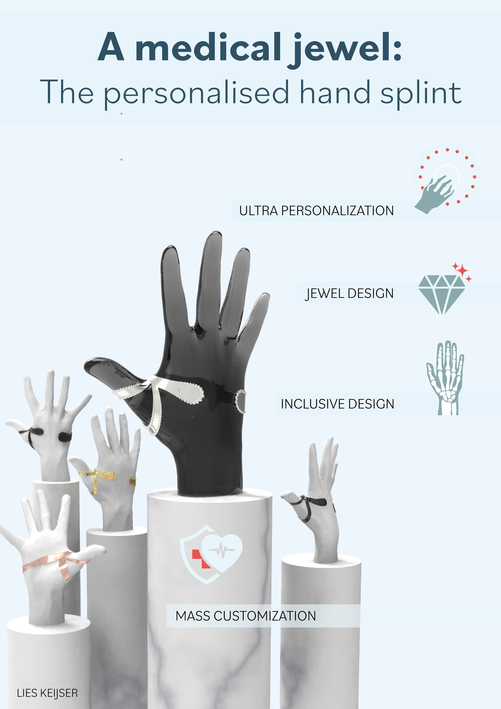

# A medical jewel, the hand splint

Created: April 28, 2023 4:05 PM

```{tags} 3d-scans, personalized
```

Authors: Keijser, Lies

Categories: Graduation Project

Supervisors: Huysmans, T. (mentor), Minnoye, A.L.M. (mentor)

URL: https://repository.tudelft.nl/islandora/object/uuid%3A8689a874-2460-4a80-b39a-70010d6562c9?collection=education



## Abstract

Your hands are the most precious tools in daily life. Therefore, it is easy to imagine that people with diminished hand functionality experience a reduced quality of life. This implies for patients with joint problems. Consequently, the hand functionality should be increased through splinting. Splinting is a non-operative treatment for patients with commonly rheumatoid arthritis, osteoarthritis and ehlers danlos syndrome.In this master thesis, an ultra personalized splint and service system has been designed. This product-service system includes the whole patient journey, from medical consult to gathering anthropometric data and producing the personalized splint. Throughout the design process, a computational design approach was leading. This started with defining the patient needs and the splint functionality. Thereafter, several options for data and parameter acquisition were explored. The options differed in the complexity of anthropometric data. The first concept was based on a 3D scan (3D), the second on a photograph (2D), and the third on hand measurements (1D). The latter involved the use of a statistical shape model (SSM).With regard to the 3D scanning procedure, both mesh wrapping and digital posture correction were implemented and evaluated. Unfortunately, this did not result in an accurate design reference. Further research on posture correction for orthosis design is therefore recommended.Additional research on 3D scanning of patients with rheumatoid arthritis gave great insight into the possibilities concerning the 3D scanning process. 3D scanning involves great challenges with regard to patients with pathological hands. The process remains not viable until an instant 3D hand scanner becomes available. The SSM is proposed as a bridging solution towards the instant 3D scan or eventually incorporating the hand scan in artificial intelligence (AI) processing workflows.Furthermore, a parametric computational design has been modelled. This design automatically adjusts to the anthropometric data of the patient. It allows for customization of the medical requirements and the aesthetic features. There has been emphasized on medical jewellery design. Different materials have been explored for this purpose.Finally, the fit and functionality evaluation showed good results. The splint fits snugly and only a few aspect with regard to the functionality needs to change.