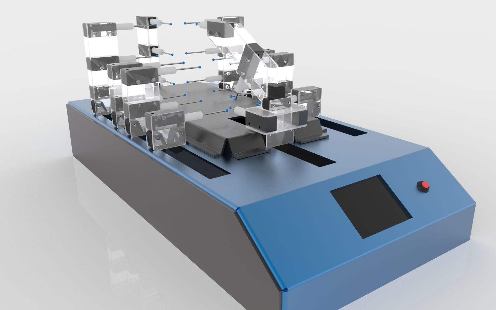

# Development of a low-cost 3D foot scanner

Created: April 28, 2023 4:05 PM

Tags: 3d scans, personalized

Authors: Hoeksema, J.

Categories: Graduation Project

Supervisors: Molenbroek, J.F.M. (mentor), Song, Y. (mentor)

URL: https://repository.tudelft.nl/islandora/object/uuid%3A0ee880fb-7063-42cd-aa82-b67f7c84d1e9

# Abstract

As 3D-design and production tools are becoming increasingly important in the development of new products, the urge to 3D-digitize complex objects rises. A solution is found in a reverse engineering tool that allows real life objects to be converted into a digital representation. Those so called 3D-scanners are the subject of this graduation thesis, more specifically in the field of feet related products. At the moment of writing, 3D-scanners are generally considered expensive and do not always form a good substitute for traditional methods. This is mainly caused by specific properties required to make 3D-scanning a useful tool for the intended application. As current 3D-scanning solutions lack the ability to adjust to specific applications, the number of suitable applications remains low. This in turn has a negative effect on the costprice. Furthermore does 3D-scanning require knowledge on digital design and manifucturing tools. This knowledge was found to form a barrier in the implementation of 3D-scanning. However, in the production of feet related products, 3D-scanning has the potential to positively influence production efficiency as manual labor can be replaced by digital modelling. The complex shape of the foot is traditionally measured by hand, cast with plaster or estimated by eye. Those methods often involve a messy and laybor intensive production processes. Applications that involve the production of feet related products appeared to be very versatile. Where one application demands for a specific property in order to make the tool functional, another application might not benefit at all from this property. It was therefore found that a tool is required that has the simplicity to be applied without the need for extensive training, and at the same time has the flexibility to adjust to application specific demands. Since the integration of all those demans into a single device would be seemingly impossible, a more modular approach was used. Rather than using an optical non-contact tool to gather the required data, this design approach uses mechanical contact pins that ‘feel’ the shape of the object. Although this might seem like an obsolete technique, the system is designed to minimize the technical complexity and integrates application specific knowledge to achieve a useful result without demanding excessive data. Furthermore, this mechanical digitizing technique makes the process more insightful for the operator. The pins can be adjusted manually without requiring any knowledge on digital modelling. Due to the simplicity of the data output, the digital model can be previewed life during the digitization process. To illustrate this technique a showcase application was selected that involves the automatic generation of a shoe last for the production of mass customized shoes. A design is presented that incorporates knowledge on shoe fit to limit the number of required data points while constraining the measuring error. The limitation of data points keeps the complexity low and makes the mechanical construction possible. In order to give meaning to the data from the mechanical digitizing device, a parametric model was designed and tested. This model automatically creates a digital approximation of the foot that can be used as a basis for a shoe last design. As this system is designed to output a shoelast rather than the shape of the foot, the production workflow does no longer include the digital conversion from foot to shoe last.