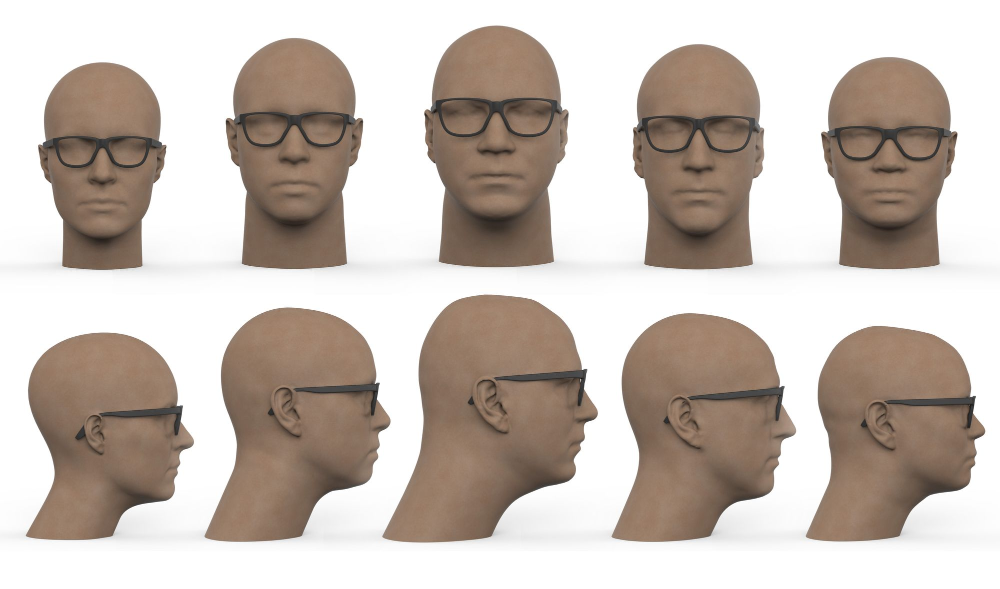

# Design of customizable sunglasses based on additive manufacturing techniques

:::{card}
**Authors:** Van Wijngaarden, R.

**Last Edited:** 2023-07-15

**Supervisors:** Song, Y. (mentor), De Smit, A. (mentor)

**URL:** https://repository.tudelft.nl/islandora/object/uuid%3A33a65390-41bb-4fb2-b2ac-7166fca7e87a

:::

```{tags} 3d-scans, personalized
```



## Abstract

The advent of additive manufacturing techniques offers innovative solutions to customizable consumer products. This paper presents the design and development of customizable sunglasses using additive manufacturing processes. By leveraging the flexibility and scalability of technologies such as 3D printing, we introduce a novel approach to sunglasses design that allows for individual customization in terms of size, shape, color, and additional features. The paper begins with an exploration of the current challenges in the eyewear industry, such as mass production limitations, lack of personalization, and environmental concerns. Subsequently, we introduce our design methodology, utilizing computer-aided design (CAD) software and additive manufacturing techniques to create sunglasses tailored to individual preferences and needs.

Several iterations of prototypes were fabricated, testing various materials and design principles. The process is optimized for efficiency, aesthetics, durability, and comfort, while minimizing waste and reducing the carbon footprint. A comparative analysis with traditional manufacturing methods is also provided, demonstrating the superiority of additive manufacturing in terms of customization capabilities and sustainability. Additionally, we address potential commercial applications and the future scalability of the process.

In conclusion, this study provides a comprehensive overview of the potential additive manufacturing holds for the eyewear industry, particularly in creating unique, environmentally-friendly, and customizable sunglasses. The findings of this study have implications for both the eyewear industry and the broader field of consumer product design, revealing the untapped potential of 3D printing in creating personalized, on-demand products.