# Data-Driven Personalized Design

Created: February 24, 2023 12:14 PM

Tags: 3d scans, data-driven, personalized

Categories: Lesson

Review: Ready for Review

📌 **Outlines:** A short description of what you can expect in the upcoming section.

📑 **Explanation text:** Written explanations with supporting images.

👩‍🏫 **Explanation videos:** Explaining the course material in short lecture videos.

📺 **Tutorial videos:** Follow-along tutorials.

💡 T**ips:** Tips and tricks to make working in Rhino/Grasshopper easier.

🖱️ **Exercises:** Small practice questions. The solution is provided.

💻 **Assignments:** Open-ended assignments, to practice further with the course materials.

This tutorial focuses on data-driven design using Rhino Grasshopper for ergonomic design. The tutorial covers collecting data for ergonomic design, analyzing ergonomic data with Rhino Grasshopper using data to inform design, and additional reading on lattice structures and meta-materials. The tutorial includes a case study on designing a shoe sole based on pressure data collected from a user's foot standing on pressure sensors. It includes step-by-step instructions, Grasshopper scripts, and images to illustrate the concepts covered in the tutorial.

# 1. Introduction

](Data-Driven%20Personalized%20Design%20279521f489bd48acbce3a8f10f2e2eab/makerbot_runninng_shoe.png)

[https://www.core77.com/posts/71778/MakerBot-Design-Series-The-Running-Shoe](https://www.core77.com/posts/71778/MakerBot-Design-Series-The-Running-Shoe)

By understanding how users interact with a product and where they experience pain or discomfort, designers can create products tailored to their users' needs and preferences [Design for Personalized Fit](../Design%20for%20Personalized%20Fit/%21index.md), we explored how we can create the basis for our product geometry from the user’s 3D scanned data to ensure a personalized fit. In this lesson, we will explore how we can expand on personalized products by adding additional functionality and ergonomic comfort to the design.

In this tutorial, we'll explore how designers can collect data to inform their design and provide examples of how Rhino Grasshopper can be used to create parametric designs that respond to the collected data to improve comfort for the end user

# 2. Collecting Data for Ergonomic Design

Collecting user data is a crucial step in the data-driven design process. Gathering data about how users interact with a product can help designers create products tailored to their users' needs and preferences. In this section, we will discuss different types of data that designers can collect for ergonomic design in Grasshopper.

## Pressure Data

Pressure data is a common type of data collected in ergonomic design. Pressure sensors can be used to measure the distribution of pressure on a surface, such as a seat or a shoe sole. This data can be used to create products that distribute pressure more evenly, reducing discomfort and pain for the user.

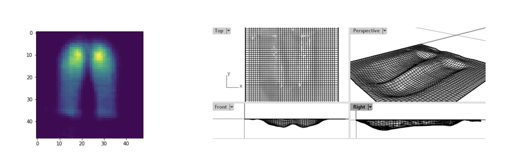

Designing a shaped seat-pan cushion to improve postural (dis)comfort reducing pressure distribution and increasing contact area at the interface, Iolanda Fiorilloa, Yu Song, Peter Vink, Alessandro Naddeo

## Heat Distribution Data

Heat distribution data can also be collected in ergonomic design. This type of data measures the temperature distribution on a surface. For example, it can be used to create products that regulate temperature by reducing material use around areas of high heat distribution.

## Sensitivity/Pain Data

Sensitivity/Pain data is another type of data that can be collected in ergonomic design. This data is typically collected through user input and can help designers understand where users experience pain and discomfort when using a product. This can be collected in a highly localized approach by focusing on a specific area of the body and applying discomfort to a number of points around this body part. This information can be used to create products that reduce or eliminate pain and discomfort.

# 3. Case Study: Designing a Shoe Sole Based on Pressure Data

In this tutorial, we will explore a case study of using pressure data collected from a user’s foot while standing on pressure sensors. This example is inspired by a paper from the TU Delft Faculty of Industrial Design Engineering on designing shape seat-pan cushion to improve the comfort of the user (Fiorillo 2021). 

In the end, the goal in this tutorial will be to use this pressure data to drive the design towards a more comfortable shoe sole to support and enhance the comfort of the user’s foot. We will explore how data from a CSV file can be read and visualized on a surface using colors to represent the pressure values at each point on the surface. Next, we can use Rhino Grasshopper to modify the geometry in various ways based on the data, such as molding the surface to the pressure data or creating a variable density grid to create a more comfortable shoe sole. Additionally, we can use Rhino Grasshopper plugins to explore the use of lattice structures and meta-materials in data-driven design.

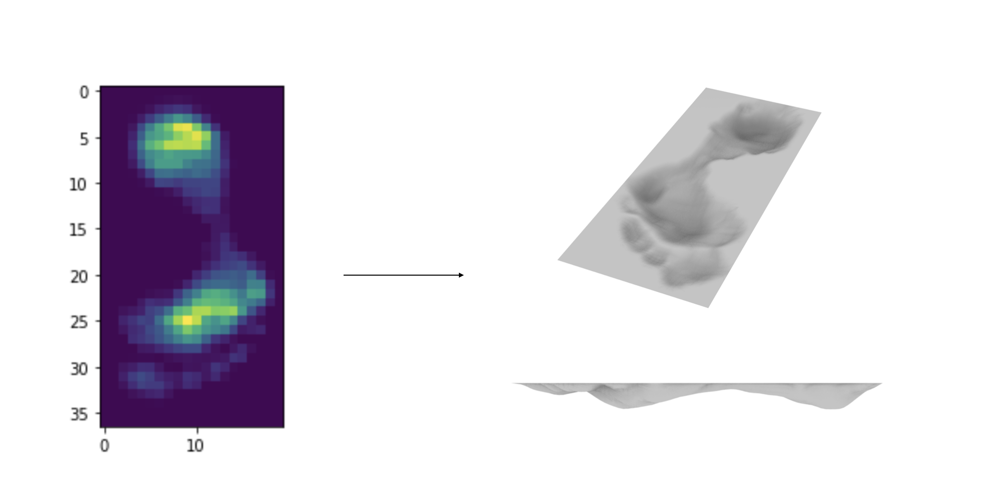

Case study of using foot pressure data to drive the design of a shoe sole

<aside>

💡 To follow along with this tutorial, make sure to download the following grasshopper script and CSV file containing the foot pressure data:

</aside>

[Data-Driven Design_ShoeSole.gh](Data-Driven_Design_ShoeSole.gh)

[FootPressure_Data.csv](FootPressure_Data.csv)

# 4. Analyzing Data with Grasshopper

In this section, we will discuss how Rhino Grasshopper can be used to analyze, interpret, and visualize ergonomic data, specifically pressure data

## 4.1 Reading the Data

To start, download the files and save it to your computer. Click on the **File Input** component and select the CSV file on your computer. Next, we will use the **Read CSV** component to read the data from the CSV file with the specified delimiter ( “;’ in this case). Connect the **Read CSV** component to a **Panel** component to verify that the data was read correctly and a data tree was created.

## 4.2 Set Up Rectangular Grid

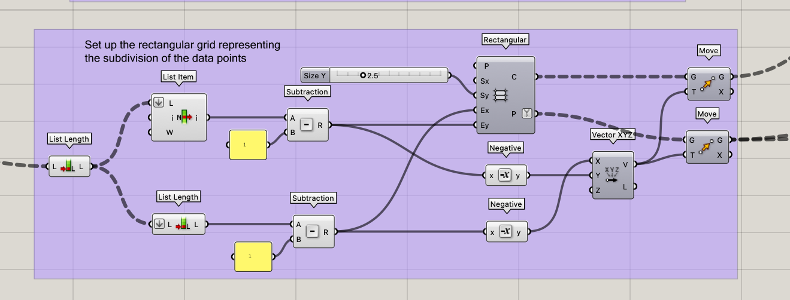

The next step is to set up the rectangular grid to represent the subdivision of data points. The idea here is to create a cell per data point in the CSV file thus each cell containing a respective pressure data point. To generate the rectangular grid, we need to know the number of cells in the X and Y direction. This is corresponding to the number of columns (x) and rows (y) in the CSV file. In Grasshopper, the data is represented by a data tree with a depth of 1 containing a list at each branch. The number of branches would represent the number of columns (x) in the grid, and the number of lists would represent the number of rows (y). 

Here we use the List Length component once to obtain the (y) and we use the component again to obtain the (x). We then subtract “1” from both values as we are translating from point to cell to ensure the data will match the rectangular grid cells. We then use the **Rectangle Grid** component to create a grid of cells/points that represents the pressure sensor data. Finally, we use the **Move** component to center the grid to the center of the Rhino viewport.

## 4.3 Mapping the Data

Next, the **Remap Numbers** component is used to map a range of values to another range of values. This is useful when working with data that has a wide range of values, such as the pressure data collected in the shoe sole case study discussed in this tutorial. By remapping the pressure values to a range between 0 and 1, we can use the normalized values to visualize the data on a surface using colors and modify the geometry later on. 

The **Remap Numbers** component takes as input three sets of values: the minimum and maximum values of the original data range, and the minimum and maximum values of the desired output range. It then maps the input values to the output range using a linear transformation. For example, if the original data range is from 0 to 100 and the desired output range is from 0 to 1, the **Remap Numbers** component will map the input values of 0 to 100 to the output range of 0 to 1. 

Finally, we use the **Graph Mapper** and **Multiplication** component to fine tune the final mapping of the data. This can be adjusted manually later in the design process to achieve the desired results. In this particular case, we use the **Multiplication** component to control the maximum depth of the molding of the shoe sole in the next section.

## 4.4 Visualizing the Data

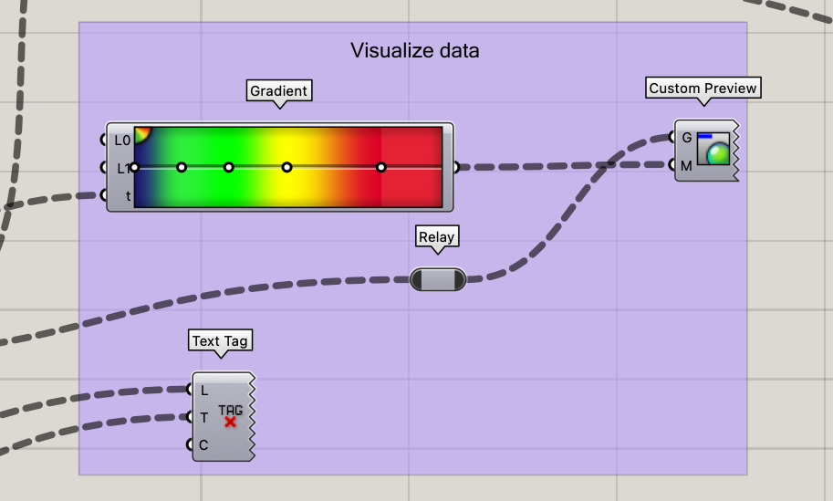

We can visualize the pressure data on a surface using text and heat map colors to represent the pressure values at each point on the surface. This allows us to see where pressure is concentrated on the surface and make design decisions based on this information.

### 4.4.1 Visualizing the Data Points as Text

The data points can be visualized as text on the rectangular grid  This provides a more detailed understanding of the pressure values at each point on the surface. To do this, the **Text Tag** component can be used to add the pressure values as text to each point on the surface. This takes as input the points from the **Rectangle Grid** and the data values from the **Read CSV.** This can be useful for providing a more detailed understanding of the pressure values at each point on the surface.

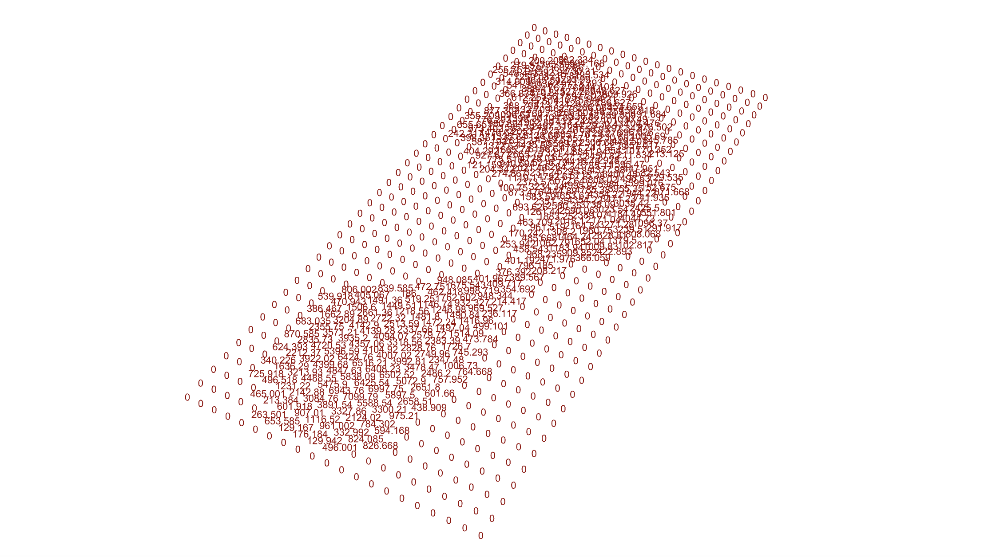

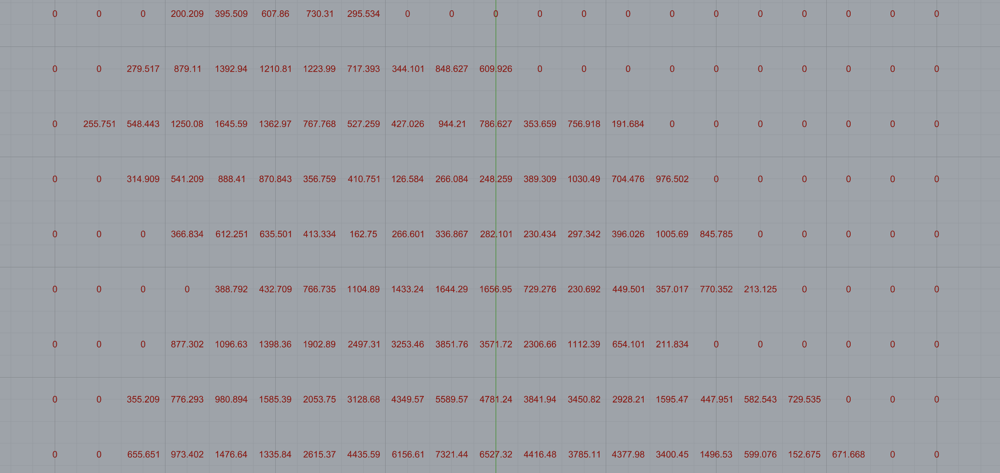

### 4.4.2 Visualizing the Data Points as Heat Map Colors

Heat maps are a useful way to visualize pressure data, allowing us to see where pressure is concentrated on a surface. In Grasshopper, we can use the **Gradient** component to map the pressure data to a range of colors. The **Gradient** component takes as input a set of values and maps them to a range of colors based on a user-defined color gradient. We use the remapped values as input for the **Gradient** component in this case generating a color of blue for 0 and red for 1 with the other colors for any values in between.

Finally, The **Custom Preview** component takes as input the custom color gradient from the normalized pressure data and the rectangular grid cells from **Rectangle Grid** and outputs a set of colored surfaces that represent the pressure values at each point on the surface.

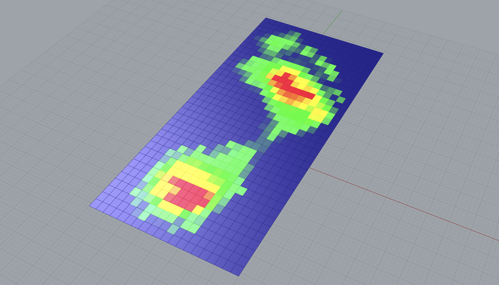

# 5. Using Data to Inform Design

## 5.1 Molding surface to pressure data

Once we have collected and analyzed ergonomic data, we can use this information to drive the design process. One way to use this data is to mold a surface to the pressure data. 

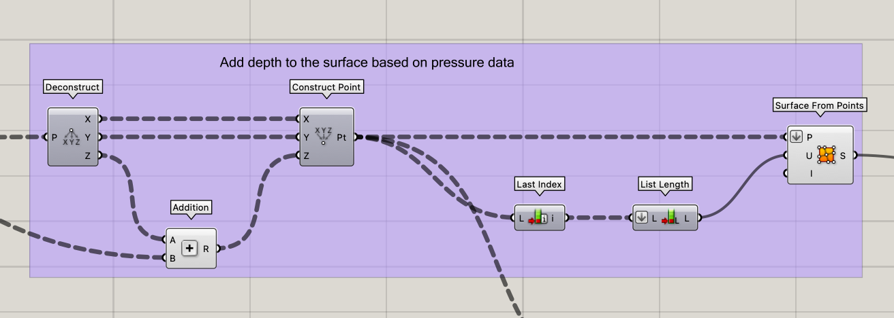

First, we can use and modify the values from  [4.3 Mapping the Data](https://www.notion.so/4-3-Mapping-the-Data-9be673cd00664870b0239281d06c59da?pvs=21) to map the pressure data to a range of values that can be used to modify the geometry. Here we take the points from the **Rectangle Grid** component and deconstruct it into XYZ. To mold the design in the Z direction, we add the remapped pressure data values to the Z axis and construct new points. Using the **Surface From Points** component, we can then create molded rectangular surface with the shape of the user’s foot derived from the pressure data.

### 5.1.1 Create Shape of the Sole

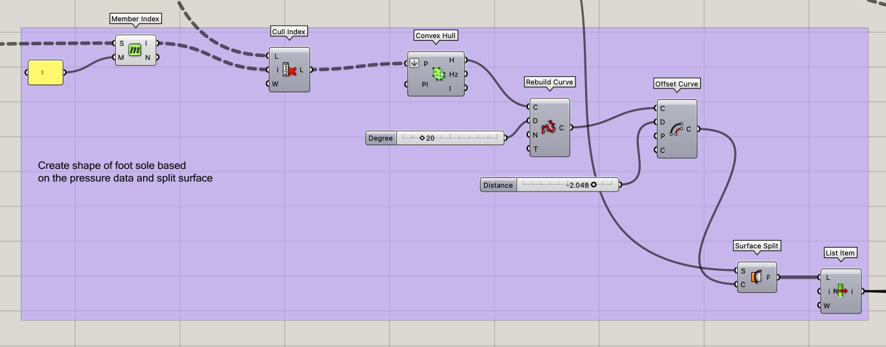

In this example, we will use the pressure data to generate the shape of the shoe sole as we do not have additional information on the foot. The idea is to generate an estimated outline around the non-zero pressure points and create a surface within this outline. In Rhino Grasshopper, the **Convex Hull** component can be used to generate an “outline” or convex hull from a set of points. A convex hull is the smallest convex polygon that contains all the points in a given set. In other words, it is the shape that encloses a set of points in the most efficient way possible, without any unnecessary jutting out or indentations.

We first begin by removing the non-zero points using the **Member Index** and **Cull Index** components. We then use this as input into the **Convex Hull** with additional modifications to the curve. Finally, we use the curve to split the molded rectangular surface generated before using the pressure data and use the **List Item** component to only select the surface with the shape of the shoe sole.

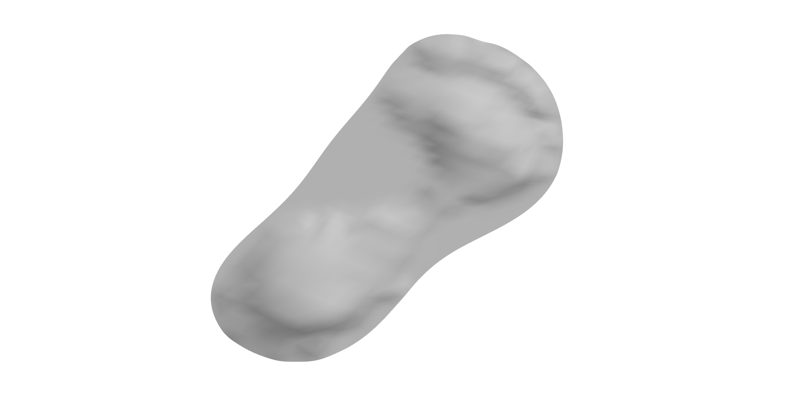

### 5.1.2 Loft the Surface of the Sole

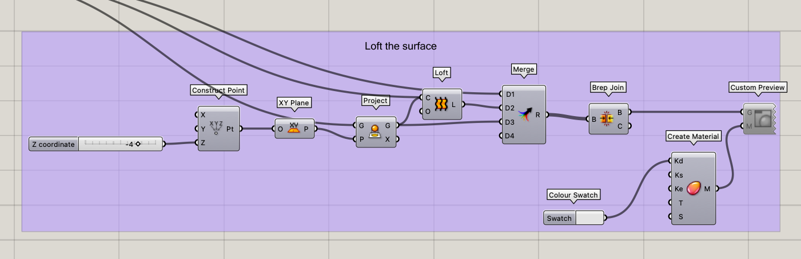

Once we have the shape of the sole, we can use Rhino Grasshopper to loft a surface between the user's foot shape and an offset plane. We project the curve onto the offset plane before lofting the two surfaces. This surface can then serve as the base for the shoe sole and further modifications can be added such as applying an adaptive lattice structure on the inside as will be discussed in the further reading.

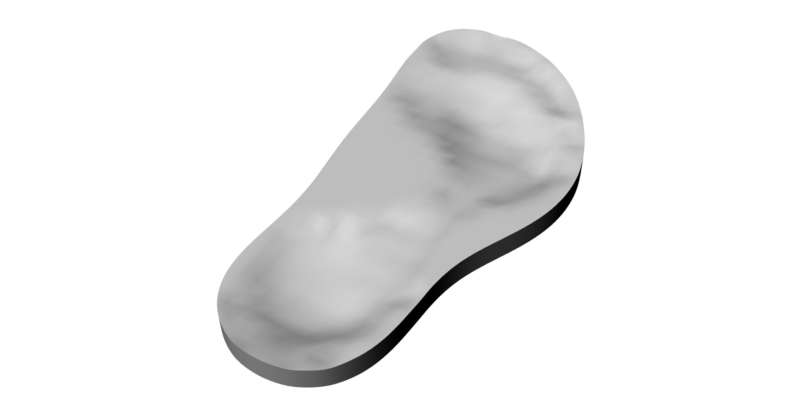

## 5.2 Variable Density Grid

<aside>

💡 This section requires the Lunchbox plugin for use of the **Grid Structure** component which can be found here (it can still be installed on Mac): [https://www.food4rhino.com/en/app/lunchbox](https://www.food4rhino.com/en/app/lunchbox)

</aside>

Another way to use pressure data to inform the design process is to create a variable density grid. This can be done using Grasshopper to create a rectangular grid that responds to the pressure data. The grid can then be used to provide additional support in high-pressure areas by locally increasing the density of the grid while maintaining a lower density in low-pressure areas to allow for flexibility and a lightweight design.

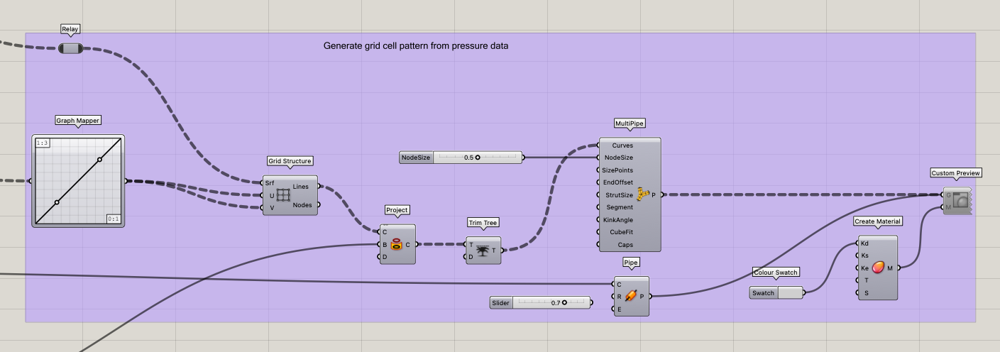

The concept to generate the variable density grid is similar to the attractor concept discussed in [Lesson 3 - Data structures](../../Lessons/3%EF%B8%8F%E2%83%A3%20Lesson%203%20-%20Data%20structures/%21index.md). Here we take the remapped pressure values and we use the **Graph Mapper** to map the values from 1 to 3. Next, we use the **Grid Structure** component from the **Lunchbox Plugin** which takes an input surface (here we use the **Rectangle Grid** cells) and the U and V inputs determines the density of the grid per rectangle cell (therefore we use the remapped values from 0 to 1 here). Next we project the grid structure generate onto the molded shoe sole top surface. Finally, we add thickness to the grid by using the **MultiPipe** component. 

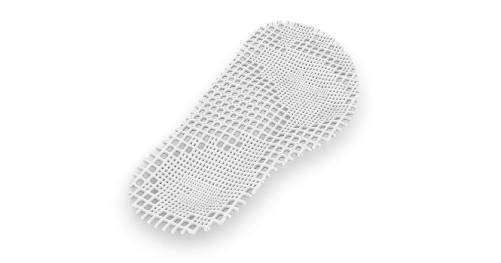

To close off the shoe sole, we can apply a **Pipe** component to the outline curve to create a thicker outline to the shoe sole.

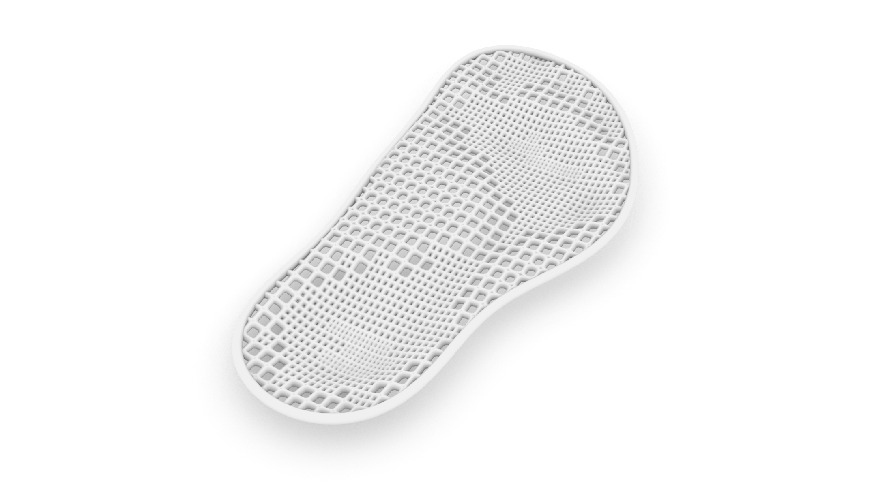

# 6. Extra Reading

## Lattice Structures

Another way to use data-driven design is to create lattice structures in response to the collected data. Lattice structures are lightweight and flexible, making them ideal for applications such as shoe soles or other ergonomic products.

In Rhino Grasshopper, we can use plugins such as Crystallon to create lattice structures that respond to the collected data. For example, we can use pressure data to determine the density of the lattice structure in different areas of the product in 3D. 

[https://www.food4rhino.com/en/app/crystallon](https://www.food4rhino.com/en/app/crystallon)

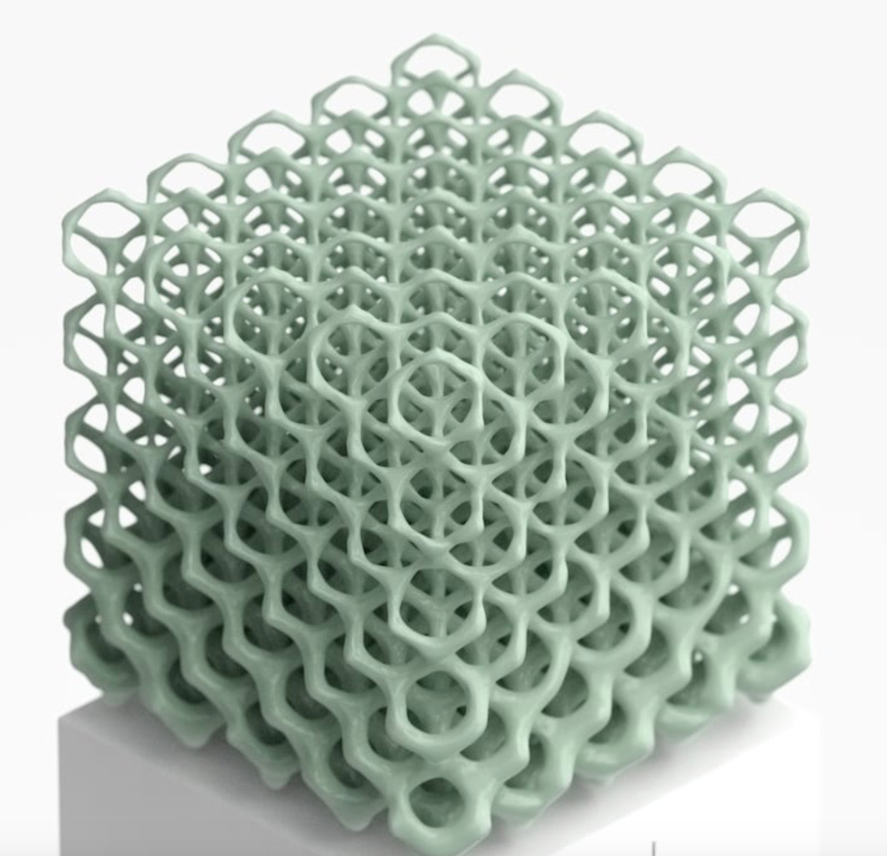

## Meta-materials and Auxetic Structures

Meta-materials and auxetic structures are another area of interest in data-driven design. These materials have unique properties, such as negative Poisson's ratios or tunable stiffness, that can be useful in ergonomic product design. By using data to inform the design of these materials, we can create products that are not only comfortable but also more durable and efficient. There is a lot of potential for innovation in this area, and it will be exciting to see how data-driven design continues to shape the future of ergonomic product design.

*Davide Jose Nogueira Amorim, Troy Nachtigall, and Miguel Bruns Alonso. 2019. Exploring mechanical meta-material structures through personalised shoe sole design. In Proceedings of the 3rd Annual ACM Symposium on Computational Fabrication (SCF '19). Association for Computing Machinery, New York, NY, USA, Article 2, 18. https://doi.org/10.1145/3328939.3329001*

Additionally, you can take a look at the following graduation projects which explore meta-materials and data-driven design to create a personalized design for their user

[**Application of mechanical metamaterials in a parametric, 3D printed ankle foot orthosis**](../../Graduation%20Projects/__Application%20of%20mechanical%20metamaterials%20in%20a%20parametric%2C%203D%20printed%20ankle%20foot%20orthosis__/%21index.md) 

[**Design of a 3D printed prosthetic socket that accommodates pediatric growth**](../__Design%20of%20a%203D%20printed%20prosthetic%20socket%20that%20accommodates%20pediatric%20growth__.md) 

# Relevant Projects

[Untitled Database](Untitled%20Database.csv)

# Draft

# Outline

1. Introduction

- Define data-driven design and explain its importance in the design process.

- Briefly introduce Rhino Grasshopper and its capabilities for data analysis and parametric design.

2. Collecting Data for Ergonomic Design

- Discuss the importance of collecting user data for ergonomic design.

- Outline various methods for collecting ergonomic data

3. Analyzing Ergonomic Data with Rhino Grasshopper

- Explain how Rhino Grasshopper can be used to analyze and visualize ergonomic data, such as heat maps and pressure maps.

- Provide examples of Grasshopper plugins that can assist with data analysis, such as Ladybug Tools for environmental analysis and Kangaroo for physics simulations.

4. Using Data to Inform Design

- Describe how ergonomic data can be used to inform the design process.

- Provide examples of how Rhino Grasshopper can be used to generate parametric designs that respond to the collected data.

- Highlight the benefits of data-driven design, such as improved product performance, user satisfaction, and reduced manufacturing costs.

5. Conclusion

- Summarize the key points of the blog post.

- Emphasize the importance of data-driven design in creating products that are tailored to user needs.

- Encourage readers to explore Rhino Grasshopper and its capabilities for data-driven design.