# Generative Form Finding with Kangaroo Physics

:::{card}
**Authors:** Jose Martinez Castro, Wolf Song

**Last Edited:** 2023-08-03
:::

```{tags} Form-Finding, Generative, Simulation
```
## Introduction

This tutorial focuses on using Kangaroo physics simulations in Grasshopper to create generative geometry. In this tutorial, we will discuss the basics of physics simulation and how it can be used to create generative geometry. We will go over the necessary components needed to set up a Kangaroo simulation and how to set up constraints and goals for the simulation to achieve the desired outcome.

Learning Kangaroo physics simulations in Grasshopper provides a new computational thinking model for creating generative geometry. This can be useful for a wide range of applications, from architecture and product design. Kangaroo simulations can be also be used to model complex physical phenomena, such as the behavior of textiles or the growth of natural systems. This can provide insights that might be difficult or impossible to obtain through other means. 

## Basics

In this section, we will learn how to set up Kangaroo in Grasshopper. Kangaroo requires a different way of thinking than the traditional Grasshopper workflow. With Kangaroo, we use what are called “Goals” to define the various forces and constraints acting on the geometry during the Kangaroo simulation. Additionally, the designer must be careful on optimizing the input geometry to ensure the simulation runs effectively as it can be a computationally intensive task.

To set up a Kangaroo simulation in Grasshopper, the general steps are as follows:

1. Prepare the input geometry

    a. We need to use meshes, where the resolution of the mesh defines the resolution of the simulation

2. Decide on the physical constraints that will be applied to the system

    a. Deciding which parts of the geometry will be fixed, which will be flexible, where the forces will be applied, etc

    b. Based on this, we need to isolate the different parts of the geometry such as the main mesh, edges of the mesh, points where the forces will applied, etc

3. Apply Kangaroo Goals components to the parts of the geometry to assign the constraints

4. Use the Show component to select which geometry to show in the output

5. Set up Kangaroo solver

    a. Merge all the Goal components

    b. Make sure to add reset and toggle on/off button add controls for simulation

6. Run the simulation 

7. Adjust Goal parameters or resolution of components to obtain desired results

Take a look at the example showcase where we discuss different potential application cases of generating geometry with Kangaroo to learn how to set up typical Kangaroo scripts. We will walk through the steps discussed above to set up the Kangaroo Physics examples and create the simulation.

## Example Showcase

This section demonstrates several examples, including:

- Creating an Organic Textile Cross Structure
- Creating a Textile 3D Tent
- Creating a 3D-printed Shape Changing Textile
- Creating a Growing Pattern on a Vase

Additionally, one advanced example is also included showing how Kangaroo Physics can be applied to generate a personalized earbud using an ear 3D scan using the 3D scan from [Design for Personalized Fit](../Design_for_Personalized_Fit/!index.md)
### Creating an Organic Textile Cross Structure

:::{dropdown} Download the Grasshopper Script Here:

[GenerativeMesh.gh](GenerativeMesh.gh)

:::


In this example, we will showcase how to create an organic cross structure with textile-like behavior with fixed outer edges. By adjusting the parameters of the simulation, we can shrink/expand the structure and even generate wrinkles on the surface of the geometry.

The grasshopper script file contains the Grasshopper definition that demonstrates how to create the structure. First, we will create the surface of the cross structure by joining two cylinders together. The Mesh Brep component is used convert the surface Brep into a mesh.


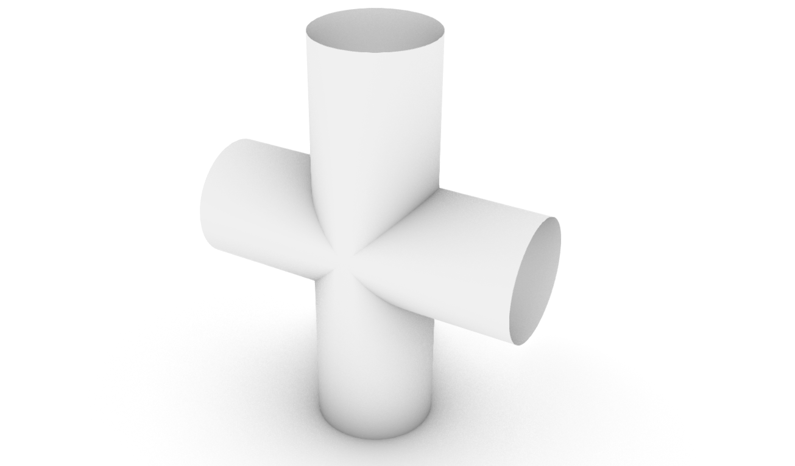

Next, we need to improve the quality of the mesh to run the simulation smoothly. When preparing a mesh for use with Kangaroo Physics, we want to avoid having mesh faces of different sizes and mixing triangle and quad faces in the same mesh. For this, we will use the Quad Remesh component to transform our original mesh into a cleaner mesh with all Quad faces of the same size. We can additionally use the Quad Remesh Settings components to further adjust the resolution new quad mesh.

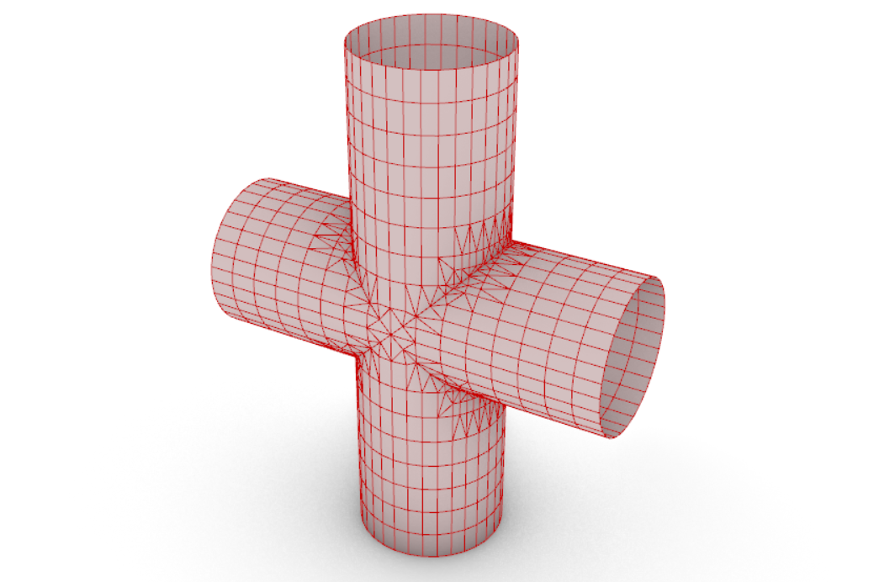
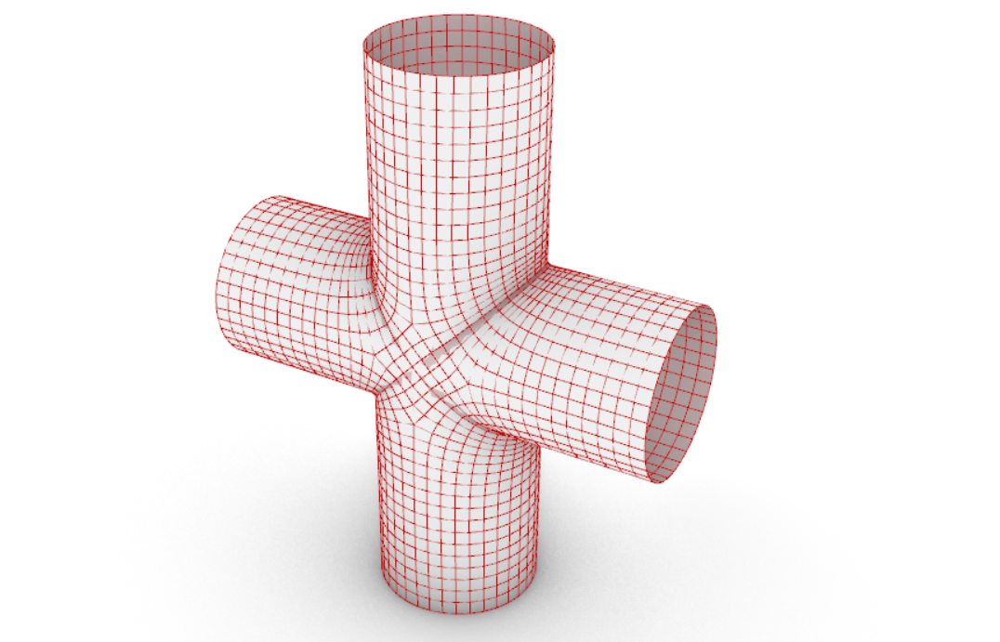

Next, we will apply the physical constrains or boundary conditions for the simulation. For this example, our goal is the following (refer to the image below):

- To have a flexible inner mesh that behaves similar to a textile (blue mesh)
- To fix the points of the outer edges of the cylinders to be fixed in space and rigid (green points)


To achieve the desired result, we will use the following Kangaroo Physics components:
- Anchor: Fixes the specified points in space to their original location, or the location of a target point
- EdgeLengths: sets the edge length of the specified mesh thus allowing the mesh to shrink or expand based on the value of the LengthFactor input (<1 shrink, >1 expand)

Finally, we connect the mesh geometry to the Show component. This ensures that when we run the simulation, the final simulated preview displays the shape change of the mesh. Similarly, we could choose to input the edges or points of the mesh into the Show component if we desired a different preview.


The next step is to load the Kangaroo Goal components onto the Kangaroo Solver. This is done by connecting the Kangaroo components to the "Kangaroo Solver" component. In this case, we will use the BouncySolver to run the simulation. By following these steps, the organic textile structure is simulated in real-time. The simulation can be stopped at any time using the Boolean Toggle and the generated geometry can be baked and used for further processing.


It is important to note that these steps provide a general overview of how to set up a Kangaroo simulation in Grasshopper. Additionally, the simulation parameters can be adjusted to achieve different results. For example, the strength of the forces, the number of iterations, or other simulation parameters can be adjusted to achieve the multiple variations

### Creating a Textile 3D Tent

:::{dropdown} Download the Grasshopper Script Here:

[Generative_Tent.gh](Generative_Tent.gh)

:::


The first step to begin the simulation is to create the input mesh geometry. We can simply create a Plane Surface and convert it into a mesh using the Mesh Surface component. Here, the U and V count will determine the number of quad faces of the surface (or the resolution of the mesh).


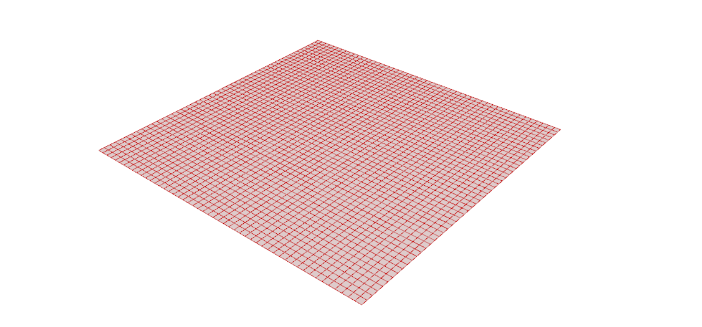

Next, we will use the corner points of the surface plane and move them individually in the Z-direction to create the target location for the simulation. Here we can use the Gene Pool component to easily adjust the target location of each of the 4 points.


Next, we will add our physical constraints to the system. We will add the mesh to the EdgeLengths component ensuring that we have a LengthFactor below 1 to create a shrinking/tension on the textile. For the Anchor component, we will connect the original location of the 4 corner points to the Point input and the moved target locations to the Target. This will allow us to move the tent in the z-direction during the simulation. Finally, we will connect the Mesh to the Show component for the simulation preview.


Once we have connected all the Goal components to the Kangaroo solver, we will have a result similar to the image below. Here our original flat plane is now transformed to a textile in tension connected at the 4 corner points. By simply moving the 4 corner points in space, we can generate different shapes for the final geometry. As an additional exercise, try to add more anchor points to the simulation (e.g. the center point of the plane) with a moveable target location to see if you can create even more complex shapes with this simulation.


### Creating a 3D-printed Shape Changing Textile

:::{dropdown} Download the Grasshopper Script Here:

[Shape_Changing_Textile.gh](Shape_Changing_Textile.gh)

:::


In this example, we will take a look at simulating 3D printed shape changing textiles. This shape changing phenomenon occurs when you 3D print on top of a stretchy fabric such as Lycra while the fabric is under tension in the printing bed. Due to the tension forces on the fabric, once it is released from the print bed, the fabric will deform to a pre-determined shape based on the 3D printed pattern, the thickness of the print, printing material, and many other affecting parameters. An example of such shape changing behaviour can be shown in the experiments conducted by Master's student Naomi  Atmopawiro below.


Resulting Shapes of 3D Printed Patterns on Stretched Fabric from TU Delft Master's thesis "  
Designing a locomotive device driven by a shape memory alloy composite" by Naomi  Atmopawiro.

Simulating the complex behaviour of shape changing textiles after 3D printing is a difficult task with many parameters to consider. In this example, we will simulate a simple example that can be use as the base for simulating more complex 3D printed patterns. The example consists of a circular pattern (blue) 3D printed on the fabric (yellow) as represented in the image below.

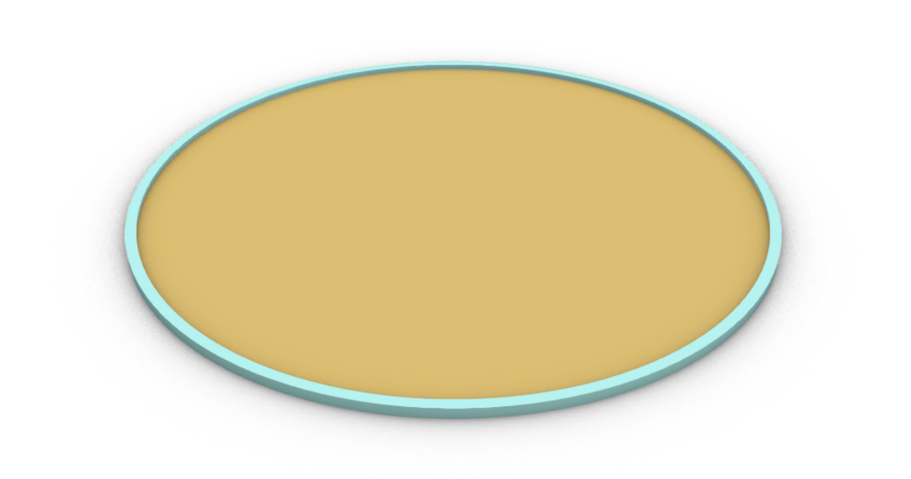

We will begin similarly to the previous examples by generating the mesh circle that will represent our input geometry. In this example, we will need a slightly different approach than before and will introduce some new Kangaroo Physics components. Our goal here is as follows:

- To have a flexible inner mesh geometry that behaves like a textile
- To have semi-flexible outer edges that will deform the textile based on their tension
- To have a fixed point in space to keep the mesh in place
- To apply a small localized force on a point of the mesh to get the mesh to deform in the out-of-plane direction (z axis)

As seen in the image below, we will select two points on the outer edge of the circle, one will be fixed and the other we will apply the force on.
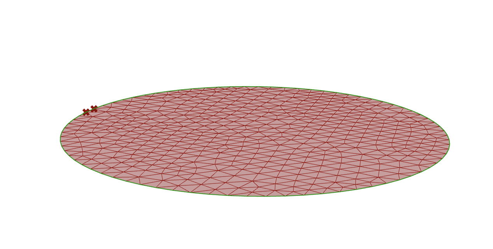

We can now start building our physical constraints on the system as described above in Grasshopper:
- Load: connect one of the points on the outer edge of the mesh to the Point input and add a force vector in the Z-direction to apply a load at that point
- Anchor: connect the other point on the outer edge to the Anchor component to fix it in space
- Rod: this component takes a polyline curve and convers it to semi-flexible rod with variable stiffness. By adjusting the parameters such as the Length Factor, we can simulate the tension forces that the 3D print pattern is applying on the textile.
- EdgeLenghts: connect the mesh to this component to make the mesh behave like a textile.

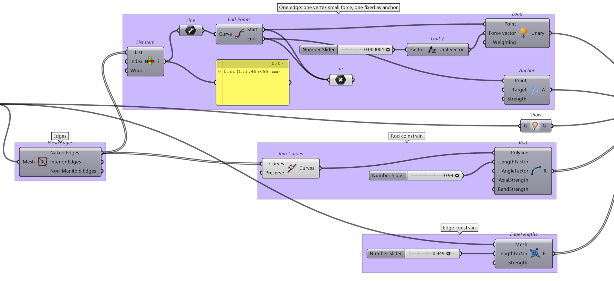

With all the Kangaroo components set up, you can start the simulation and see that the circular textile deforms into a potato chip like shape. Test out a similar implementation with different shapes and patterns to see the various types of geometry you can generate with this simulation.

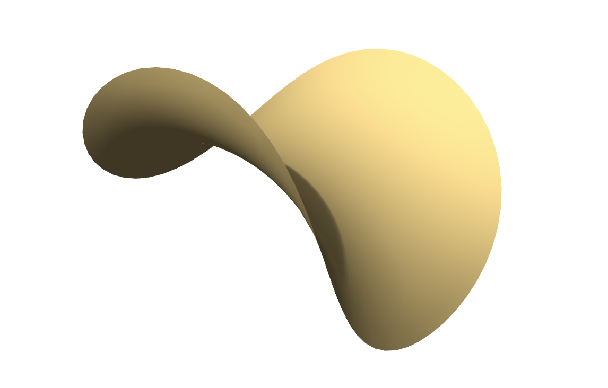
### Creating a Growing Pattern on a Vase

:::{dropdown} Download the Grasshopper Script Here:

[Generative Grow on Vase.gh](Generative_Grow_on_Vase.gh)

:::

Explanation coming soon (Wolf)


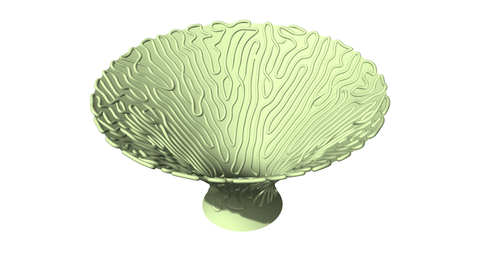

## Case Study: Personalized Design from 3D Scan using Kangaroo Physics

:::{dropdown} Download the Grasshopper Script Here:

[Generating_a_Mesh_from_Ear_Canal_Cavity__Kangaroo_Physics.gh](Generating_a_Mesh_from_Ear_Canal_Cavity__Kangaroo_Physics.gh)

:::

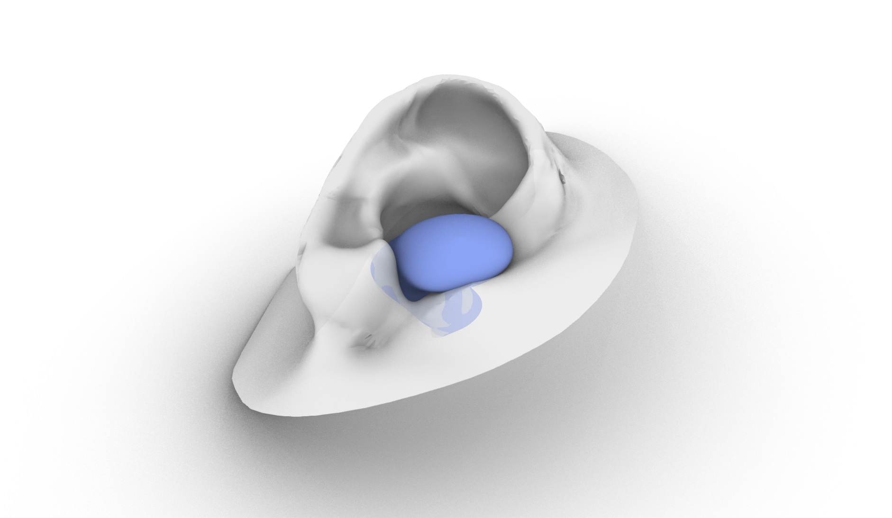

In [Design for Personalized Fit](../Design_for_Personalized_Fit/!index.md), we discussed various examples of how to generate personalized products using a variety of approaches, including working with 3D scanned geometry. Although unconventional, we can use Kangaroo Physics to generate such personalized geometry when dealing with complex 3D prints. Let's take for example, the geometry of an ear canal. In this scenario, we would like to create an earbud that is personalized for the user's 3D scan and perfectly fits the cavity of the ear canal. We have already shown in the original lesson how we can create a negative of the inner ear canal to obtain the perfect fit earbud. 

Another approach we can take is to use Grasshoppers Kangaroo physics simulation to generate the geometry of the earbud instead. This involves a physics collision simulation where we fill the ear canal with small spheres that occupy the inside volume of the ear canal. By finding the overall volume taken up by the spheres in the ear canal, we can generate the perfect fit earbud for the 3D scan.

It is important to note that the following approach is for advanced users, only works on Windows PC for now, and requires the following plugins:

:::{card} Plugins to download:

- [Weaverbird](https://www.giuliopiacentino.com/weaverbird/)
- [Lunchbox](https://www.food4rhino.com/en/app/lunchbox)
- [Pufferfish](https://www.food4rhino.com/en/app/pufferfish)
- [Dendro](https://www.food4rhino.com/en/app/dendro)

:::

A summary of the approach taken is shown below. For further details on the implementation, please take a look at the grasshopper script included:

1. Simplify the geometry of the ear to speed up the simulation

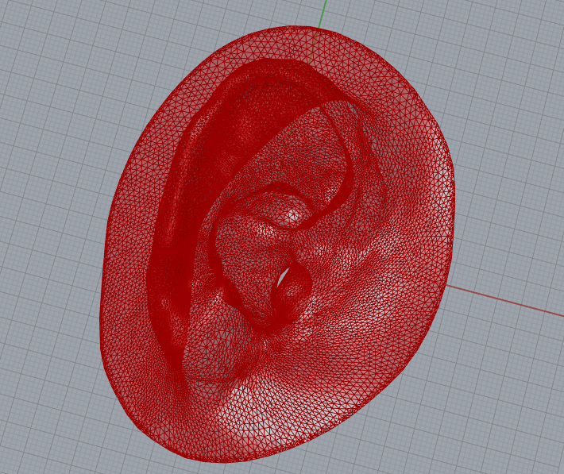

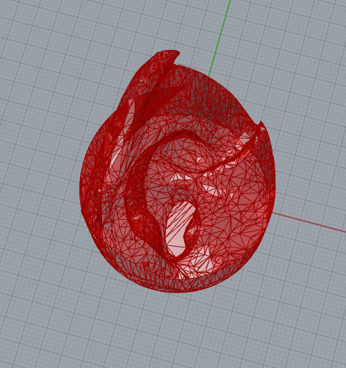

2.  Prepare a distribution of small spheres to collide with the ear canal and set up the simulation with Kangaroo

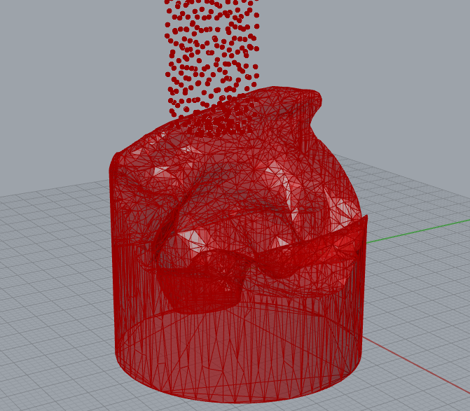

3. Run the simulation allowing the spheres to collide with the ear and fill up the ear canal cavity

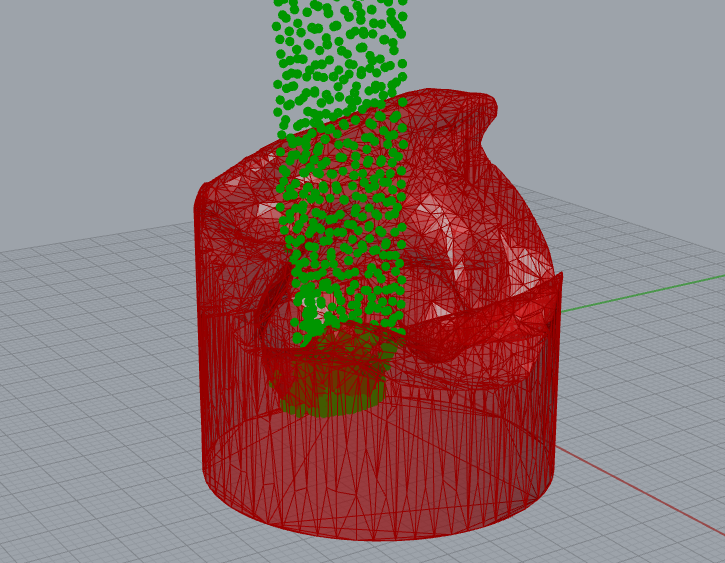

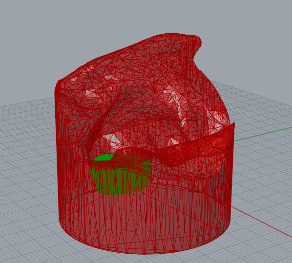

4. Create a volume from the collection of spheres and convert into a mesh

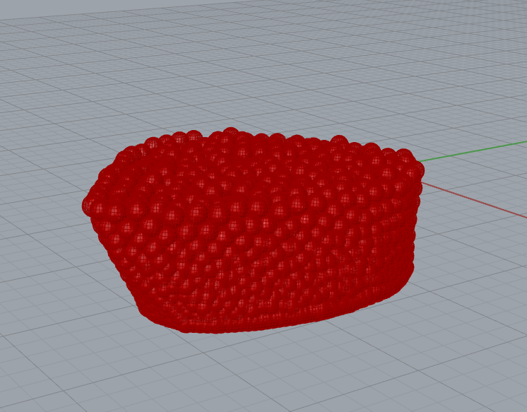

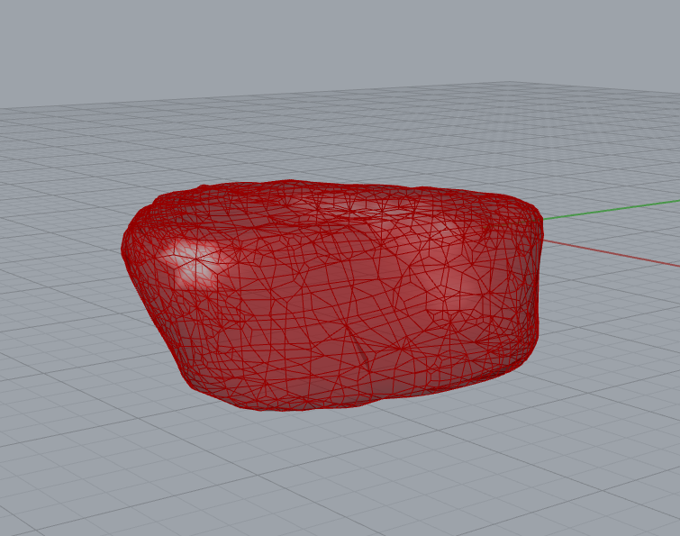

In this approach, we can adjust the size and shape of the final mesh by adjusting the simulation parameters. For example, if we want the earbud to cover a larger area of the ear, then we can add more balls to the simulation to increase the total area covered by the balls. Experiment with the example file and test it out for yourself!
