# Lesson 1 - Basics

```{tags} Introduction
```

:::{card}
**Authors:** Anne van den Dool, Niels van Silfhout

**Last Edited:** 2023-07-21
:::

:::{card}
📌 **Outlines:** A short description of what you can expect in the upcoming section.

📑 **Explanation text:** Written explanations with supporting images.

👩‍🏫 **Explanation videos:** Explaining the course material in short lecture videos.

📺 **Tutorial videos:** Follow-along tutorials.

💡 **Tips:** Tips and tricks to make working in Rhino/Grasshopper easier.

🖱️ **Exercises:** Small practice questions. The solution is provided.

💻 **Assignments:** Open-ended assignments, to practice further with the course materials.
:::

## 👩‍🏫1.1 Introduction (3 min)

<iframe width="560" height="315" src="https://www.youtube.com/embed/YeSgIJmp9OY" frameborder="0" allow="accelerometer; autoplay; clipboard-write; encrypted-media; gyroscope; picture-in-picture" allowfullscreen></iframe>

---

## 📑1.2 Basic controls (30 min)

:::{card}
📌 *What:* Introduction to the controls of Rhino and Grasshopper (reading), Working in Rhino and Grasshopper (exercise)

*For Whom:* Beginners in Rhino/Grasshopper

*Time:* 30 min (15 min reading+ 15 min exercise)
:::

If you are new to 3D design software, using Rhino and Grasshopper for the first time can be a bit overwhelming. In the next section, you will first walk through the ins and outs of the user interface, then you will learn the basic controls. Finally ending with a small exercise to get you started with Rhino and Grasshopper.

### 📑 1.2.1 Rhino: User Interface (Reading 10 min)

In this part you will explore Rhino’s User Interface.

🖱️Open Rhino

You will now see the following interface (left for 🪟windows, right for 🍎mac):

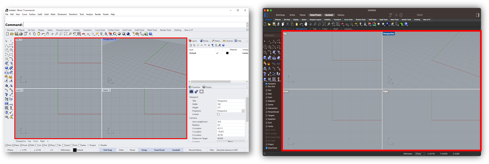

The central part of the screen is called the viewport, here marked in red. By default Rhino shows 4 different views. The viewport is your workspace, here you can view your 3D model.

:::{card}
💡 **Tip**: To make one of the viewports fill the entire window, 🖱️double click the label **(for example: **[Perspective]**). To return to the view of all four viewports, 🖱️double click the label again.
:::

At the top there are different tabs for different workflows, for example **[Curve Tools]**. By clicking these tabs you gain access to more specialized tools, and the lay-out of bar on the left and top changes. We will mostly be using the **[Standard]** tab, which is selected by default.

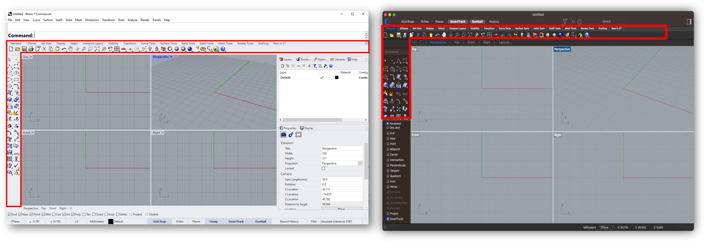

All of the different tools in Rhino can be accessed via the bar on the left. By clicking the triangle in the corner of some of the icons, you have access to even more options.


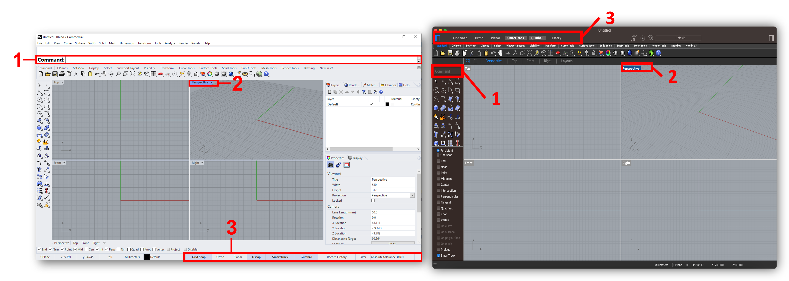

1. This is the **[Command:]** line, another way of accessing all the tools in Rhino. The **[Command:]** line is an intelligent tool, and depending on the input can do many different things, more on that later.

2. By clicking the 🔽 next to a viewport (or right click if you’re working on mac), you can adjust how your model looks. Most of the time you will use **[Shaded]**.

3. **[Gumball]** allows you to move objects directly in the viewport using handles. **[Grid Snap]**  **[Osnap]** causes tools to snap to the grid and to other objects. **[Record History]** turning this on allows you to undo and redo actions.

**Navigation**

| Rotate | Hold right mouse button |
| --- | --- |
| Pan | Right mouse button + shift |
| Zoom | Scroll |
| Select | Left click |
| Box select | Hold left mouse button and drag. Drag from right to left to select everything the box touches. Drag from left to right to select only objects completely inside box | 
| Repeat previous command | Right click |

For more shortcuts check out these webpages:

For 🍎mac: [https://docs.mcneel.com/rhino/mac/help/en-us/user_interface/shortcuts.htm](https://docs.mcneel.com/rhino/mac/help/en-us/user_interface/shortcuts.htm)

For 🪟windows: [https://docs.mcneel.com/rhino/7/help/en-us/user_interface/shortcuts.htm](https://docs.mcneel.com/rhino/7/help/en-us/user_interface/shortcuts.htm)

### 📑 1.2.2 Grasshopper: User Interface (Reading 5 min)

In this part we will look at the basic controls and interface of Grasshopper. The Grasshopper interface looks the same on each operating system. 

To open Grasshopper:

🖱️Click the ****[Launch Grasshopper]** button as shown **below

**OR**

⌨️Type “Grasshopper” in the **[Command:]** line and press Enter


The Grasshopper interface is quite straight forward. For now the most important parts are:

1. The **component library**, including tabs for any plugins you might have installed. 

2. The **canvas**, where you build your script.

3. The **file-manager**, where you can switch between documents.

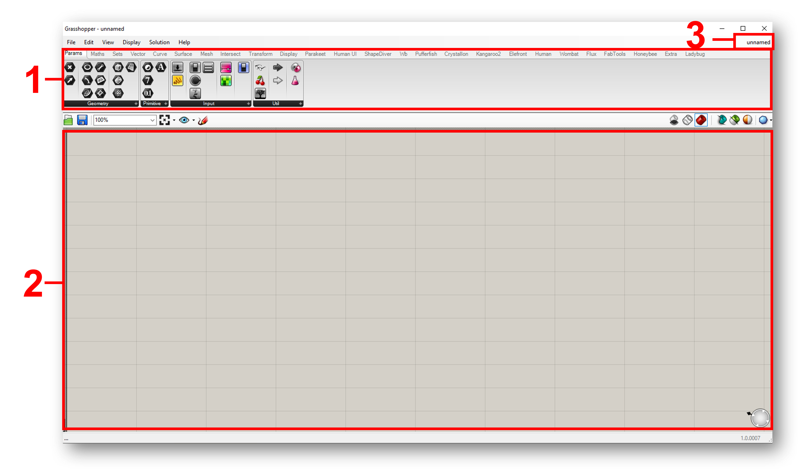

Grasshopper is a visual coding tool. This means that you create a 3D model by connecting different functional blocks together called components.

This way you can build a script which takes certain inputs to produce the desired output.


Every component has inputs and outputs. Inputs are on the left side of a block, outputs on the right side.

:::{card}

💡 **Tip**: you can switch between icons and text components in the **[Display]** menu at the top of the interface. You can also switch on **[Draw full names]** to make components easier to understand.


:::

#### **Placing and connecting components**

To place a component, either 🖱️drag from the toolbar **or 🖱️double click the workspace to search by name. 


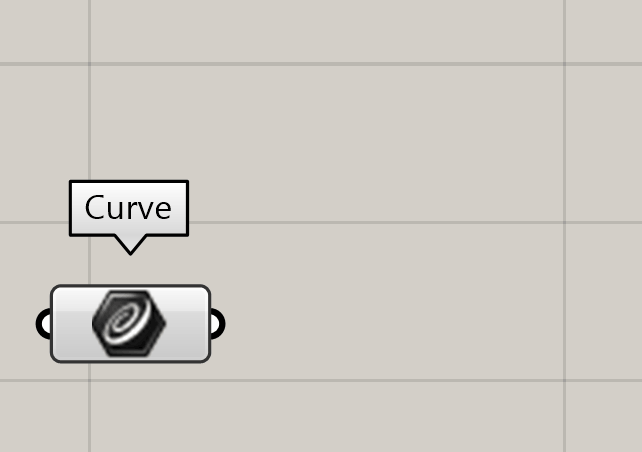

:::{card}

💡 **Tip**: To display the speech bubbles with the names of the components as shown in these images, you need to install a plugin called “Bifocals”. More on this in lesson 2.

:::

To connect components, simply 🖱️drag from an output of one component, to the input of the next. **To undo a connection, 🖱️hold CTRL (or Command on Mac) and drag from the output to the input.


#### **Inputting and Outputting Data**

When hovering your cursor over an input/output a tool-tip pops up. These tool-tips can help determine what needs to be connected where. Reading out the outputs can help verify the expected outcome and check for errors.

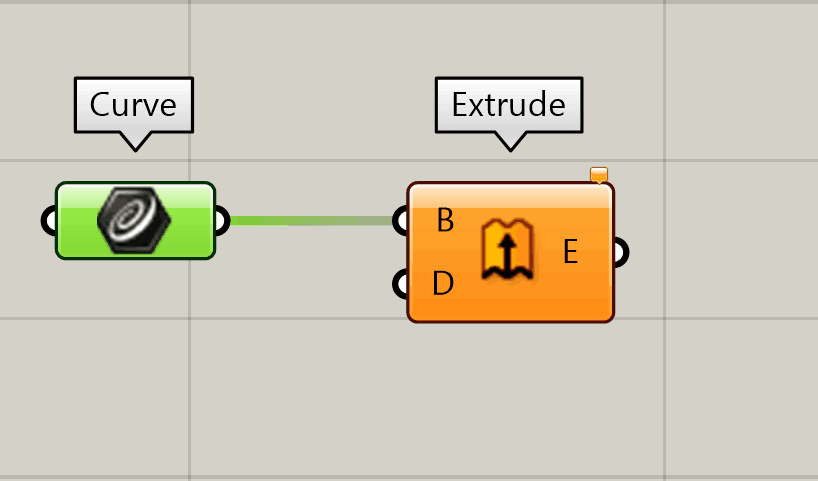

One of the basic components we will use often as an input in Grasshopper is a Number Slider. You can find them in the Input menu under params. 

By double clicking the slider, a popup appears with settings. Here you can change the name of the slider, set the number of digits and change the minimum and maximum values.

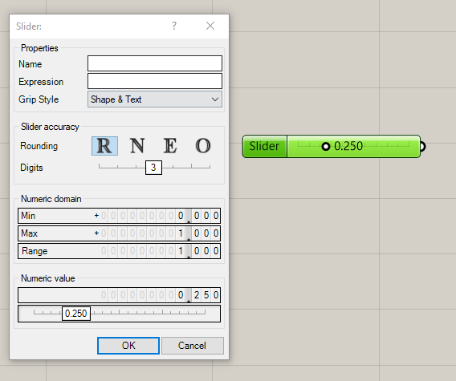

:::{card}

💡 **Tip:** For a faster way to create sliders, you type a number in the search bar to create a slider. You can also create a slider with a set range by typing the minimum followed by two dots (..) and the maximum number. The amount of digits you use to type the numbers will determine the accuracy of the slider.

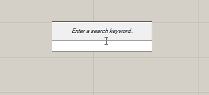

:::

You can also use Rhino geometry as an input in Grasshopper. For example if you wanted use a curve as input: 

🖱️Draw a curve in Rhino, for example by selecting **[Control Points Curve]** from the toolbar on the left.

*🖱️*Place a **[Curve]** component on the canvas in Grasshopper. You can do this by dragging it from the Params/Geometry toolbar or by double clicking on the canvas and searching for the **[Curve]** component. 

*🖱️*Right click in the middle of the component and select **[set one curve].** ****

A prompt appears in Rhino, asking you which Curve or Edge to reference*.* On windows this prompt will appear above the command line, in mac you will find it in the menu below the command line. 

🖱️Select the curve in Rhino by left clicking on it.

After selecting you curve, the curve component should turn green, indicating that it now contains geometry. 

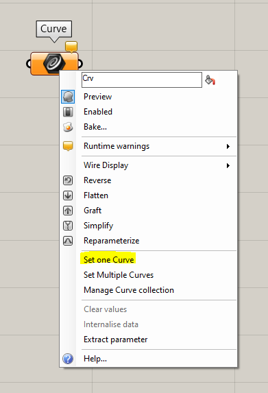

#### Exporting shapes from Grasshopper to Rhino

Shapes built in Grasshopper show up as red translucent objects in Rhino. These red objects are placeholders, and can not be manipulated directly in Rhino.

To edit your Grasshopper models in Rhino you need to export the model. This type of exporting from Grasshopper to Rhino is called “baking”.

To bake an object from Grasshopper to Rhino:

🖱️Right click the component you want to bake. Make sure you click in the middle.

🖱️Click **[Bake…]**.

🖱️ You will be asked on which layer you want to bake the object. Select **[OK]**.

You should now see your object in Rhino.

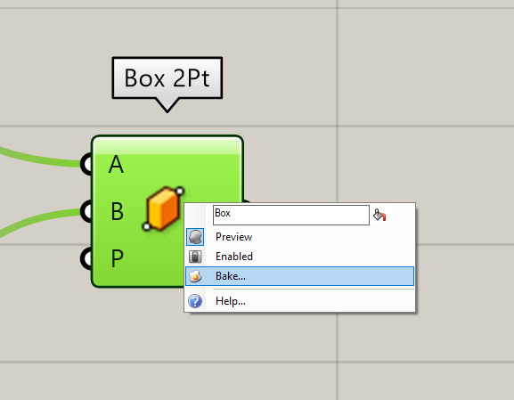

:::{card}

💡 T**ip:** Once an object is baked from Grasshopper to Rhino, you can no longer change it using the Grasshopper script (you can’t unbake an egg!). If you make changes in Grasshopper, you will need to bake it again.

:::

### 🖱️ 1.2.3 Building shapes in Rhino and Grasshopper (Exercise 15 min)

:::{card}

🖱️  **Exercise - Building shapes in Rhino and Grasshopper**

In the first exercise we will be building a simple shape in Rhino and Grasshopper to explore how these two programs work and in what ways they differ.

Try to create a cube in Rhino with the dimensions 10x10x10mm.

**Note:** You do not need use Grasshopper yet.


💡**Hint:** a cube is called “box” in Rhino.

:::{dropdown} Solution


You can either select the **[Box]** tool on the left **OR** type in “Box” in the command line.

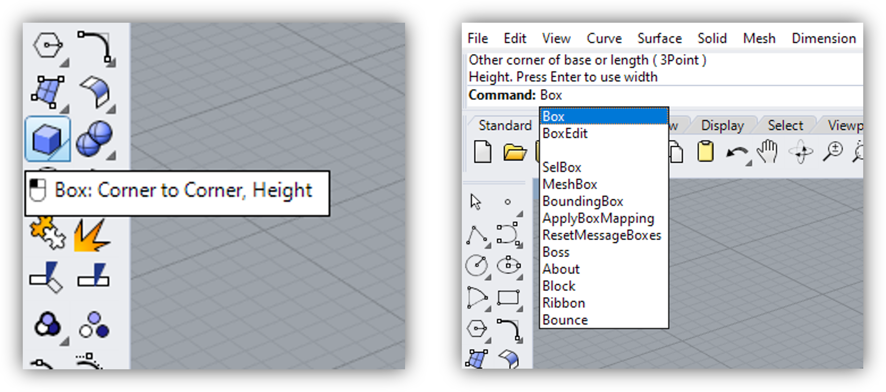

Now you can select the first corner of the base in the viewport, then the second corner, and finally choose the height of your box. You can also type the exact dimensions into the command line.


:::

:::{card}
Now see if you can create the same cube in Grasshopper. 


💡**Hint:** Use the components called **[Box 2pt]** and **[Construct Point]**


:::{dropdown} Solution

Grasshopper always allows for many different approaches to solve a problem. It is perfectly fine if you managed to get the same end result with a different script!

Here we will show one possible approach:


:::

---

## 👩‍🏫1.3 Basic geometry (45 min)

:::{card}

📌 *What:*  Introduction to the basic geometries (video explanation), Modelling geometry in Rhino and Grasshopper (video tutorials)

*For Whom:* Beginners in Rhino/Grasshopper

*Time:* 45 min (5 min video+ 40 min tutorials)

:::

### 👩‍🏫1.3.1 Theory - Basic geometry (5 min)

<iframe width="560" height="315" src="https://www.youtube.com/embed/TOz-LE0H104" frameborder="0" allow="accelerometer; autoplay; clipboard-write; encrypted-media; gyroscope; picture-in-picture" allowfullscreen></iframe>

:::{dropdown} Recap

[1 Basic geometry.pdf](1_Basic_geometry.pdf)

:::

### 📺1.3.2 **Tutorial - Modelling a teapot in Rhino (20 min)**

In this tutorial, you will learn how to construct basic geometry in Rhino. Watch the video below and follow along. 

:::{card}

💡 **Tip:** By default, the viewports in Rhino are set to wireframe mode. This means you only see the outlines of objects. You can switch to shaded mode by clicking on the  🔽 next to a viewport (or right click if you’re working on mac).

:::

<iframe width="560" height="315" src="https://www.youtube.com/embed/38Xfl50o2A8" frameborder="0" allow="accelerometer; autoplay; clipboard-write; encrypted-media; gyroscope; picture-in-picture" allowfullscreen></iframe>

### 📺1.3.3 **Tutorial - Modelling teacups in Grasshopper (20 min)**

In this exercise, you will learn how to construct basic geometry in Grasshopper. Watch the video below and follow along. If you get stuck, you can check out the full solution below. 

:::{card}

💡 T**ip:**  In Grasshopper, pay attention where you click. If you right click on the inputs of a component, you will get a different menu compared to when you click in the middle for example. If you want to group object or turn the preview of for multiple object, make sure you right click on a empty space on the canvas.

:::

<iframe width="560" height="315" src="https://www.youtube.com/embed/svhn73Yvww0" frameborder="0" allow="accelerometer; autoplay; clipboard-write; encrypted-media; gyroscope; picture-in-picture" allowfullscreen></iframe>

:::{dropdown} Solution


:::

---

## 📑1.4 Best practice (5 min)

:::{card}

📌 *What:* Some tips and tricks to help you troubleshoot in Rhino/Grasshopper (reading)

*For Whom:* Beginners in Rhino/Grasshopper

*Time:* 5 minutes

:::

### 📑1.4.1 Troubleshooting in Rhino

If you are using Rhino to design products that you plan on manufacturing, it is useful to check if your geometry is valid. You can do this by selecting an object in Rhino and looking at the properties tab in the menu. You can also use the command [**what**] to get a detailed object description. The image below shows what the object description might look like for a box. As you can see, this box is a closed solid polysurface, which means it is an closed volume that consists of multiple surfaces joined together. 

To join surfaces together into a polysurface, select the surfaces and use the [**join**] command. To un-join surfaces, you can use the [**explode**] command. This also works for curves and polycurves. 

A closed solid shape can be exported and used for digital fabrication, for example 3D printing. In lesson 4 we will discuss surfaces and solids in more detail. 


### 📑1.4.2 Troubleshooting in Grasshopper

If you run into issues in Grasshopper, take a closer look at your components to find out what is wrong. In general, if a component in Grasshopper is not colored grey, this means that it is not running correctly. An orange color indicates a warning, red indicates an error. 

You can hover your mouse over the middle of any component to find out what it does and if it is running. If you see a small speech bubble on a component, you can click it or hover your mouse over it to read the warning and error messages. Often, when you drop a new component, it will show up orange with the warning “input parameter failed to collect data”, like the example below. This simply means that you still need to connect something to the inputs in order for the component to run.


Components can also turn red, which means there is an error. This might happen because you connected an input that the component cannot use. In the example below, you see a text panel used as an input, while the component asks for a vector to use as the direction for the extrusion. Grasshopper will try to convert the text into a useful input, but in this case it is unable to, which results in the error “Data conversion failed from Text to Vector”.


### 📑1.4.3 How to keep you Grasshopper script organized

As projects get more complex, it is important to keep your Grasshopper script organized. Below are a few tips to keep your scrip readable (for yourself and others):

1. Work from left to right. Inputs should be put on the left, outputs on the right.

2. Keep connectors as straight as possible.

3. Turn off previews for components which you are not working on. This can be done by opening the right-click menu and clicking “Preview Off” while having components selected.

4. Group components by function. You can do this by selecting the components and using the shortcut CTRL+G (or Command+G on mac).

5. Label your groups. Use the component **[Scribble]** to add text

---

## 💻1.5 Assignment 1 (max 2 hours)


:::{card}

💻 Create a creature using Rhino curves, which you import into Grasshopper. It does not have to be an insect, you can create any animal you like. Take a few hours to see what you can create, but do not spend to much time on this assignment. 

Check out the [Student Showcase Assignment 1](../Student_showcase/Assignment_1/!index.md)to see what other students made for this assignment.

:::

:::{card}

💡 **Tip**: Use the [Export Hi-Res Image] option in the file menu to create a detailed screenshot of your entire script.

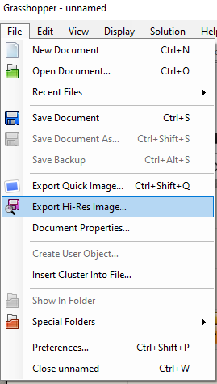

:::