# Lesson 2 - Curves and lists

```{tags} Curves, Lists
```

:::{card}
**Authors:** Anne van den Dool, Niels van Silfhout

**Last Edited:** 2023-07-21
:::

:::{card}

📌 **Outlines:** A short description of what you can expect in the upcoming section.

📑 **Explanation text:** Written explanations with supporting images.

👩‍🏫 **Explanation videos:** Explaining the course material in short lecture videos.

📺 **Tutorial videos:** Follow-along tutorials.

💡 **Tips:** Tips and tricks to make working in Rhino/Grasshopper easier.

🖱️ **Exercises:** Small practice questions. The solution is provided.

💻 **Assignments:** Open-ended assignments, to practice further with the course materials.
:::

## 👩‍🏫 2.1 Introduction (2 min)

<iframe width="560" height="315" src="https://www.youtube.com/embed/_U0E-HZWIfw" frameborder="0" allow="accelerometer; autoplay; clipboard-write; encrypted-media; gyroscope; picture-in-picture" allowfullscreen></iframe>

---

## 📑 2.2 Points, Planes and Curves (15 min)

:::{card}

📌 *What:*         Explanation of points, planes and curves (reading and exercise)

*For Whom:* Beginners in Rhino/Grasshopper

*Time:*          15 minutes

:::

In this section you will work with points, planes, curves and their anatomy. Points, planes and curves form the fundamental geometry you will need for every project. Understanding and using the anatomy of these geometries allows you to build fully parametric and generative models.

### 📑 2.2.1 Points and vectors (2 min)

A point is the most basic form of geometry. Both in Rhino and in Grasshopper, points are described by {x,y,z} coordinates. 

🖱️ In Rhino, you can create a point by selecting it from the toolbar, or by typing [**point**] in the command line. You can then select the location of the point, or type in the exact coordinates. A point is displayed as a white dot. 

🖱️ In Grasshopper there are multiple ways you could create a point. You could reference a point in Rhino with a [**point**] component, or you could use a [**Construct Point**] component to specify the coordinates with number sliders. A point is displayed as a small x. 

To move anything in Rhino, you can simply select it and use the Gumball. To move geometry to a new location in Grasshopper, you first need to create a vector. A vector describes the direction and the amount (amplitude) of the movement. Similar to points, vectors consists of an x, y and z value. There a multiple ways to create a vector in Grasshopper, for example with the [**Vector XYZ**] component. Vectors are not visualized in the Rhino viewport by default, but you can add a [**Vector display**] component to visualize them, as shown in the image below. 

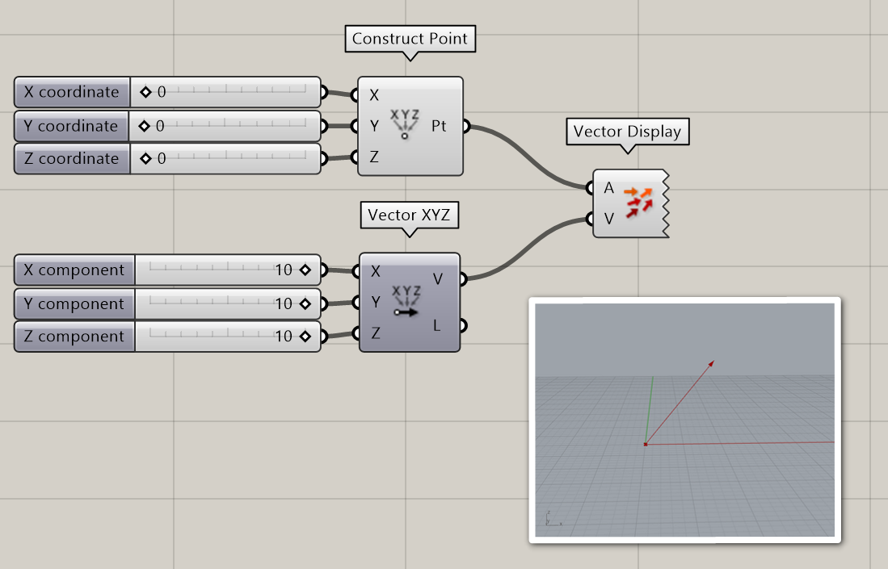

You can also read out the result of you vector component by adding a [**Panel**] component. As you can see in the example below, the data for a point and a vector look the same in Grasshopper. This makes it easy to convert a point to a vector and vice versa.

Also notice that the [**Vector XYZ**] component has a Length output. This will tell you the amount of movement, or amplitude of the vector. You can change the amplitude of any vector with the [**Amplitude**] component


### 📑 2.2.2 Reference planes (2 min)

Planes are flat and go on infinitely in two directions, making a local coordinate system. Planes are not real objects, they are used to create a coordinate system in 3D space. The world coordinate system in Rhino is described by three planes: the world XY (which is the grid that you see in Rhino), the world XZ and the world YZ. These planes can also be referenced in Grasshopper with the [**XY Plane**], [**XZ Plane**] and [**YZ Plane**] components. A custom plane can be created at any point and in any direction. 

Planes are very useful to position objects in Grasshopper. A plane in Grasshopper is described with a origin point and a normal direction. The normal direction is a vector that is perpendicular to the plane. The normal vector will tell you which side of the plane is up and which side is down. In the example below, you see a plane created with a [**construct plane**] component and a [**panel**] component. In the output panel, you can see that the origin point (O) of the plane is at {5,5,5} and the normal direction (Z) of the plane is {0,0,1}. 

:::{card}

💡 **Tip**: After you add a [**panel**] component, you can double click it to add content or edit the content. To make sure the content is read as data instead of text, right click the panel and click on **“**Multiline Data”. More on this in paragraph 2.4.

:::

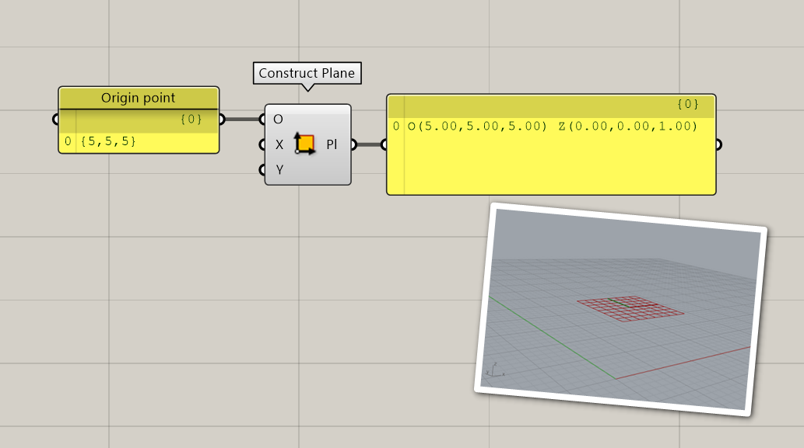

### 🖱️ 2.2.3 Exercise (5 min)

Use Grasshopper to create a plane parallel to the world YZ plane, with an origin point that is located at 5mm in the z direction, 4mm in the x direction and 1mm in the y direction.

:::{dropdown} Possible solution


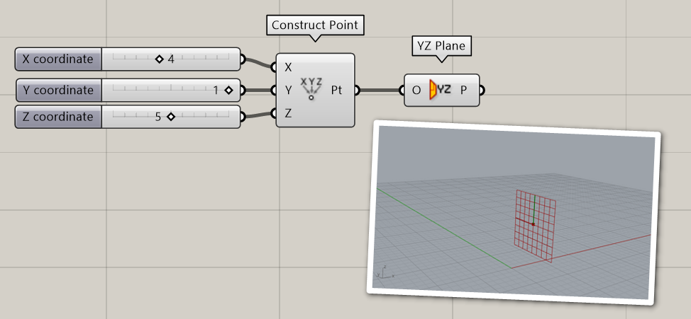


:::

### 📑 2.2.4 Curves (6 min)

A curve is a path between two or more points. You can extract a lot of useful information from just this simple geometry.

Say we have six points in Rhino and we connect them with straight lines. This is called a **Polyline**. A polyline has straight segments that are joined together. 🖱️Create a polyline in Rhino by selecting it from the toolbar on the left or by typing [**Polyline**] in the command line. 

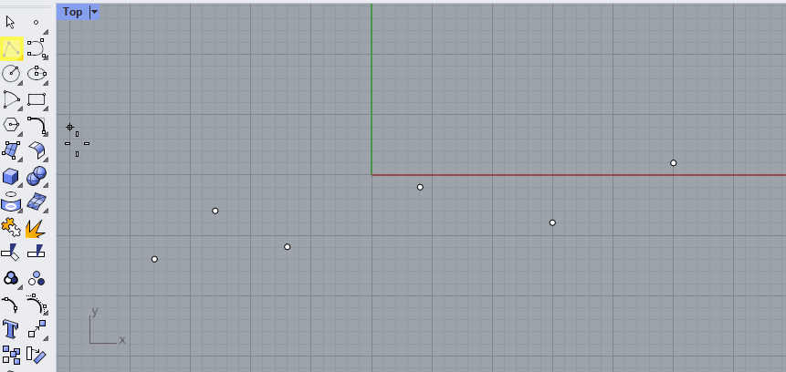

This polyline has a start and an end point, which you can find with the [**CrvStart**] and [**CrvEnd**] commands in Rhino, or with the [**Endpoints**] component in Grasshopper. 

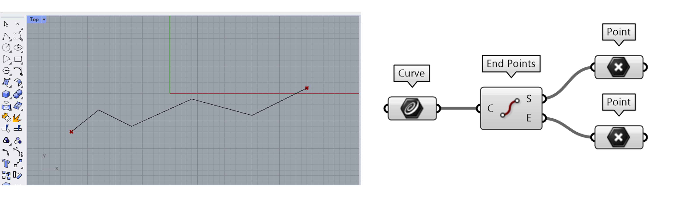

A curve also has a direction, moving through the curve from the start to the end point. You can visualize and change the direction of a curve in Rhino with the [**Dir**] command. When you select the curve you see the direction moves from start to end, but the angle is different in each section of the polyline. 

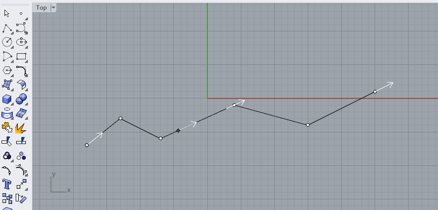

Instead of a polyline with straight segments, we could also use the same points to create a curve with bends. For example with the [**Curve**] command. Notice that you can set the curvature **degree** in the command line. In the example below, the degree was set to 3.

🖱️Create a couple of curves in Rhino with different curvature degrees to see its effect.


The type of curve that Rhino uses is called a NURBS curve. This stands for Non-Uniform Rational B-Splines. To work with NURBS curves, you need to understand two properties that define these curves: curvature degree and control points.

**Degree**

The degree of a curve is a whole number, usually between 1 and 5.  A line or polyline is a first degree curve. The degree of the curve determines the range of influence the control points have on a curve; where the higher the degree, the larger the range. This means that in a first degree curve, the direction of the curve is determined by the starting point and the first point. In a second degree curve, the direction is determined by the start, the first and the second point. In a third degree curve, the direction is determined by the start, the first, second and third point. And so on. The curvature degree can never be lower than the number of control points, this will result in an error. To change the curvature degree after creating a curve, use the [**Rebuild**] command. 

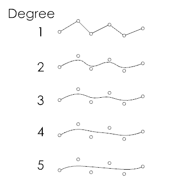

**Control points**

The control points are a list of at least the degree+1 points. You can use the control points to manipulate the shape of the curve. To switch on control points, press **F10** or use the [**PointsOn**] command in Rhino. You will also see them when you select a curve. 

**Closed / open curves**

A curve with a start and end point is called an open curve. If the start and end are the same point, we call this a closed curve (Rhino) or a periodic curve (Grasshopper). For example, circles and ellipses are closed curves. The start point on a closed curve is called the **seam point**. 

**Polycurves**

Just like you can combine straight lines into a polyline, you can [**join**] curves into a polycurve. A polycurve is made up out of segments, which you can separate again by using the [**Explode**] command. In the example below, two curves are created with the [**Control Point Curve**] command, using **Osnap** to align them to the points.  

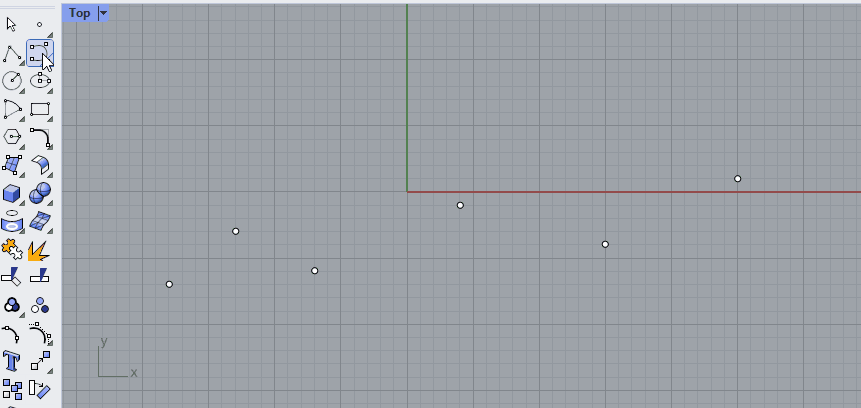

---

## 📺 2.3 Curve parameters (40 min)

:::{card}

📌 *What:*         Working with curve parameters (tutorial)

*For Whom:* Beginners in Rhino/Grasshopper

*Time:*          40 minutes

:::

<iframe width="560" height="315" src="https://www.youtube.com/embed/xEMRruaWmng" frameborder="0" allow="accelerometer; autoplay; clipboard-write; encrypted-media; gyroscope; picture-in-picture" allowfullscreen></iframe>

---

:::{dropdown} Download the final file here:

[Lesson 2 - Train tutorial.gh](Lesson_2_-_Train_tutorial.gh)

:::

:::{card}

💡 **Tip**: In this Grasshopper file, the points that were selected in Rhino are internalized into the Grasshopper script. This way you can open this Grasshopper script without having to re-link the points in Rhino. You can internalize data by right clicking on the component that is linked to Rhino and selecting “internalise data”.

:::

---

## 👩‍🏫🖱️ 2.4 Lists (30 min)

:::{card}

📌 *What:* Introduction to list data structures (video), Building a list (exercise)

*For Whom:* Beginner to intermediate level

*Time:*  30 min (10 min video + 20 min exercise)

:::

### 👩‍🏫2.4.1 Lists (10 min)

<iframe width="560" height="315" src="https://www.youtube.com/embed/0Upvg2w25qI" frameborder="0" allow="accelerometer; autoplay; clipboard-write; encrypted-media; gyroscope; picture-in-picture" allowfullscreen></iframe>

---

:::{dropdown} Download the example file here:

[Lesson 2 -Wheel.gh](Lesson_2_-Wheel.gh)

:::

:::{dropdown} Slides

[Lesson 2 video slideshow.pdf](Lesson_2_video_slideshow.pdf)

:::

### 🖱️2.4.2 Exercise: building a DNA strain (20 min)

Build a strain of DNA. You can use the script provided here as a starting point.

[Lesson 2 - DNA strain starting file.gh](Lesson_2_-_DNA_strain_starting_file.gh)

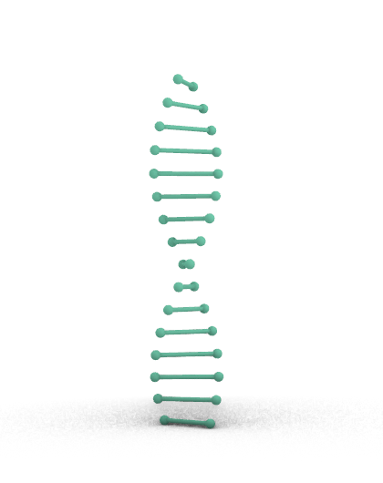

:::{dropdown} Solution


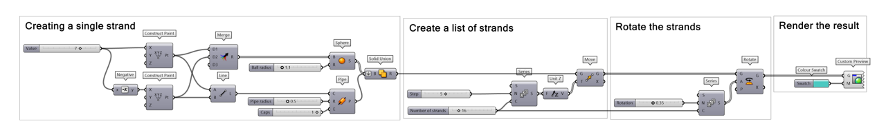


:::
---

## 💻 2.5 Assignment (max 2 hours)

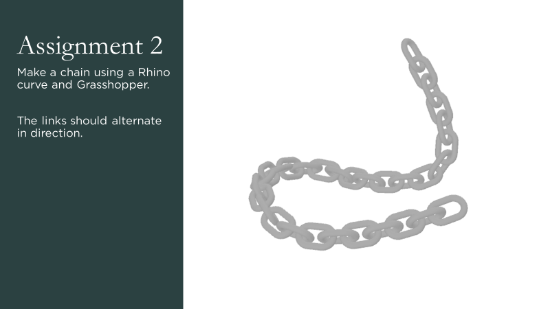

:::{card}

💻 Create a chain with alternating links. The curve should be imported from Rhino, the rest of the assignment is done in Grasshopper. You can use the grasshopper file below as a starting point. Take a few hours to see what you can create, but do not spend to much time on this assignment. 

Check out the [Student Showcase Assignment 2](../Student_showcase/Assignment_2/!index.md) to see what other students made for this assignment.

:::{dropdown} Starting File

[Lesson 2 - assignment starting file.gh](Lesson_2_-_assignment_starting_file.gh)

:::