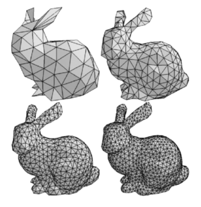
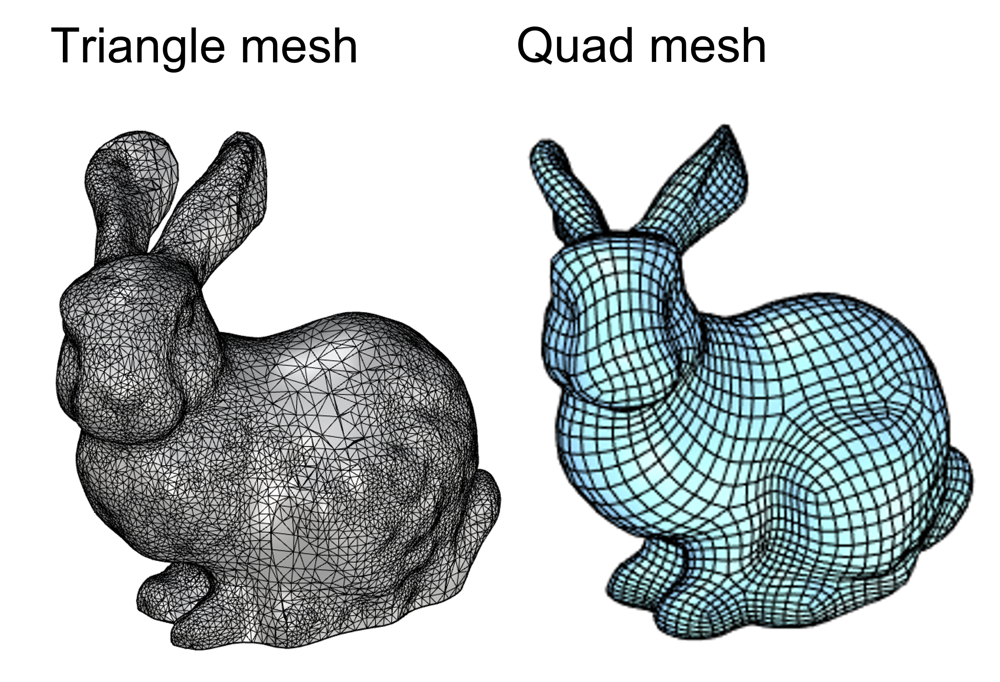
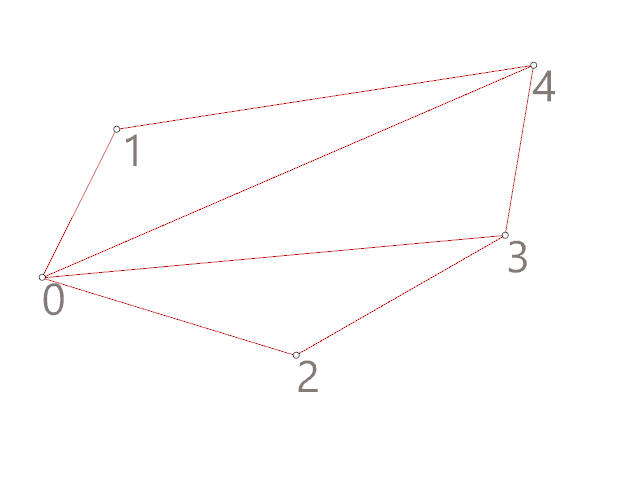
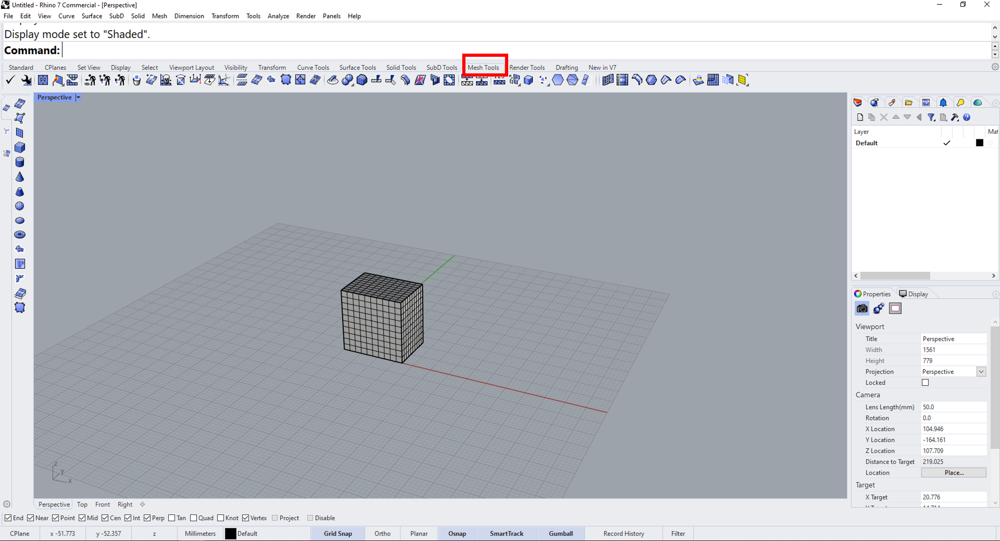

# Lesson 5 - Meshes

📌 **Outlines:** A short description of what you can expect in the upcoming section.

📑 **Explanation text:** Written explanations with supporting images.

👩‍🏫 **Explanation videos:** Explaining the course material in short lecture videos.

📺 **Tutorial videos:** Follow-along tutorials.

💡 **Tips:** Tips and tricks to make working in Rhino/Grasshopper easier.

🖱️ **Exercises:** Small practice questions. The solution is provided.

💻 **Assignments:** Open-ended assignments, to practice further with the course materials.

## 👩‍🏫 5.1 Introduction (x min)

[https://www.notion.so](https://www.notion.so)

- Video transcript

    

    

## 📑 5.2 Mesh geometry (5 min)

:::{card}

📌 *What:*         Explanation mesh geometry (reading) and exploration of mesh tools in Rhino (exercise)

*For Whom:* Intermediate in Rhino/Grasshopper

*Time:*          10 minutes

:::

### 5.2.1 📑Mesh vs. Surface geometry

A mesh is a type of geometry that consists of points and faces. It can be used for similar purposes as a BRep geometry, but works in a fundamentally different way. A BRep datatype is a mathematical representation of the object, while a mesh datatype only is a collection of points and its connectivity data. In the image below you can see a comparison between a NURB surface and a mesh. When changing the control point on a curved surface, the surface is recalculated and remains smooth. When you change a point in a mesh, this only affects the face that are directly connected to that point. 

The points in a mesh are called **vertices** and the surfaces that are created by connecting these points are called **faces**. Each mesh face also has a **normal** direction. If a mesh is a closed shape, it is considered a solid object and all the normals will point outwards. 

Meshes take less computational power to visualize, but since meshes only consist of points and faces, curved shapes will never look completely smooth. The higher the resolution of your mesh, the higher the amount of faces and the smoother it will look. You can export meshes from Rhino as STL or OBJ file for digital fabrication.

### 5.2.2 📑Mesh structure

There are two common types of meshes: triangle meshes and quad meshes. As the names suggest, a triangle mesh is a mesh with triangular faces (connecting 3 vertices) and a quad mesh is a mesh with rectangular faces (connecting 4 vertices). A combination of triangle faces and quad faces in a mesh is also possible. 

Imagine you want to create a triangle mesh based on 5 points. As you can see in the animation below, there are many ways to connect these points in to faces. In Grasshopper, you can describe a triangle face with the index numbers of the vertices that are connected by the face. For example, a face that connects point 0, 1 and 2 would be describes as **T{0;1;2}**. The T stands for triangle face. In a similar way, you can describe a quad face with four numbers, for example **Q{0;1;2;3}.** In tutorial 5.3 we will further explore how to build a mesh by connecting a collection of points. 

### 5.2.3 🖱️Mesh tools in Rhino

Mesh files like 3D scans often need some repairing or editing. You can use specialized software like Meshmixer, but you can also find some mesh tools in Rhino. 

🖱️Open Rhino and go to the [**Mesh Tools**] menu. Experiment with the toolbar on the left to create some basic mesh shapes. You can combine shapes by using Mesh Boolean commands, for example by typing in [**MeshBooleanUnion**] or [**MeshBooleanDifference**]. You can also select these tools from the mesh toolbar. 

🖱️Create a flat surface and position it through your mesh shape. Select the surface and use [**MeshTrim**] to remove a part of your mesh. This can be very useful when you are working with a large scan and you only want to work with a certain part. You can use the command **[Cap]** to close your mesh, but this will only work if the gap in the mesh is planar. 

🖱️Use the [**PointsOn**] command to visualize and manipulate individual points on you mesh. You can select them and use the gumball to move them around. Use the [**PointsOff]** command to switch the points off again. 

🖱️Once you have created an interesting shape, select it and use the **[ReduceMesh]** command to change the resolution of the mesh. You can specify how many face you would like your mesh to have, or specify a percentage to reduce by. 

🖱️Select your mesh and run the **[MeshRepair]** command. In the pop-up window, select Check Mesh. You will now receive a analysis of your mesh. If your mesh has issues, like open edges (naked edges) you can try to repair them with this tool. Click on Repair Mesh to automatically repair, or click on Next to select which issues you want to repair. If you want to use your mesh for digital production, you need to make sure your mesh is a valid closed mesh. 

## 📺 5.3 Building a custom mesh (x min)

:::{card}

📌 *What:*         Understanding mesh geometry (tutorial)

*For Whom:* Intermediate in Rhino/Grasshopper

*Time:*          30 minutes

:::

📺Video Tutorial (20 min): building a mesh, applying to loft (loft file provided)

## 📺 5.4 Morphing (x min)

:::{card}

📌 *What:*         Building patterns and morphing them (tutorial)

*For Whom:* Intermediate in Rhino/Grasshopper

*Time:*          30 minutes

:::

📺Video Tutorial (20 min): building a mesh, applying to loft (loft file provided)

## 💻 5.5 Assignment (max 2 hours)

Box morph assignment 

