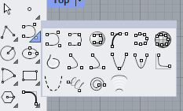
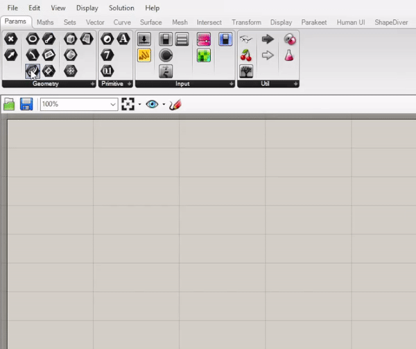
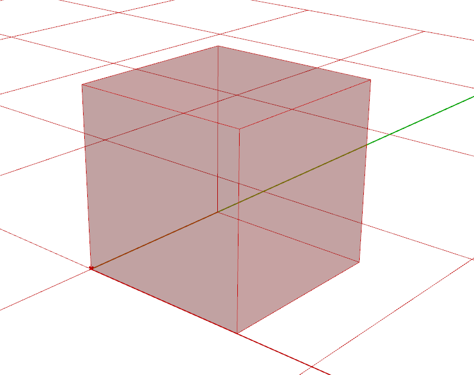
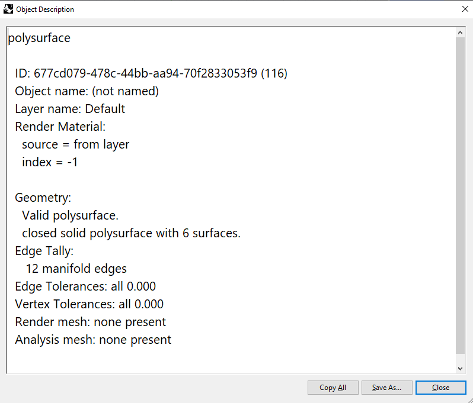
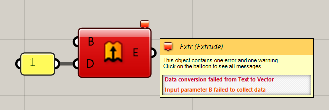
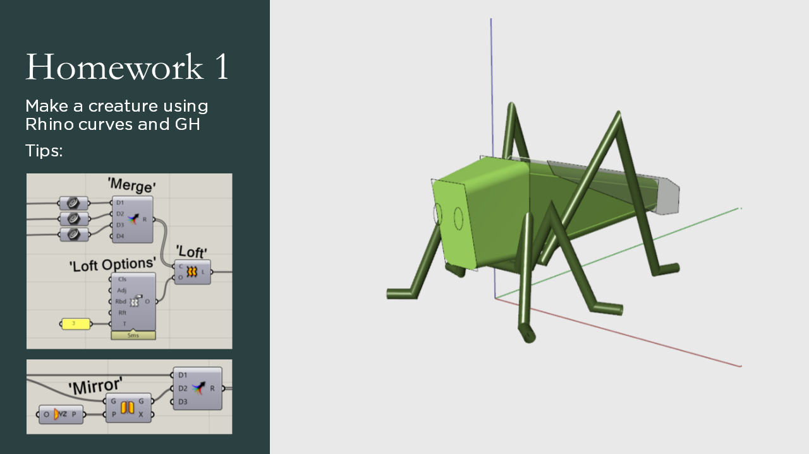

# Lesson 1 - Basics


[label](%3CDigital_Fabrication_Laser_Cutting_V2.gh%3E)

[Digital Fabrication Grasshopper](%3CDigital_Fabrication_Laser_Cutting_V2.gh%3E)


## 1.1 Introduction (3 min)

<iframe width="768" height="432" src="https://www.youtube.com/embed/P_-EHLcGvBs" title="Lesson 1 introduction" frameborder="0" allow="accelerometer; autoplay; clipboard-write; encrypted-media; gyroscope; picture-in-picture; web-share" allowfullscreen></iframe>

```{dropdown} video transcript
    
    Welcome to this digital course on computational design with Grasshopper and Rhino. In this course you will learn how to use the software, with focus on creating designs with a personalized fit, suitable for digital fabrication. 
    
    Computational design basically means that you use the calculating abilities of your computer to solve design problems. For example by building a parametric design or by using an algorithm to generate iterations of your design. In this course, you will learn how to model in Rhinoceros and how to set up a parametric workflow in Grasshopper. In the upcoming lessons we will be working towards modeling a made-to-measure design, based on a 3D scan. In this introduction lesson we will be looking at the basics of Rhino and Grasshopper. By the end of the lesson you will have built your first full workflow using these programs. 
    
    Rhinoceros, or Rhino for short, is 3D modelling software that is often used for freeform surface modeling. The type of modeling in Rhino is called NURBs modeling. NURBs are mathematical representations of 3D geometry that can accurately describe any shape. From simple lines to complex organic surfaces. This makes Rhino very suitable for modeling projects that require curved surfaces, for example automotive or yacht design. 
    
    Grasshopper is an application that started off as a plugin for Rhino, but is now a fully integrated tool in the Rhino software. Grasshopper uses a type of visual programming to help you automate your workflow. Grasshopper is an excellent tool when you are creating patterns and repetition. The software is often used in architecture and jewelry design.
    
    As a product designer, you might already have some experience with modeling software like Solidworks or Fusion. These programs are well suited for building mechanical products and solid shapes. If you have experience with coding in any programming language, you also have relevant knowledge to learn Grasshopper, as its design approach shows many similarities with programming, specifically with visual programming. When you are starting a design project, make sure you consider which program is best suited to create your design. Setting up a fully parametric workflow in Grasshopper takes some time, so make sure you consider if it is the right approach. In general, if a project requires patterns or repetition, using Grasshopper can speed up the process. 
    
    Let’s get started by exploring the Rhino and Grasshopper interface. Make sure you have both programs installed on your computer before moving on to the next part of this lesson. After looking at the basic interface and learning about basic geometry, we are going to model a teapot in Rhino and build a set of cups in Grasshopper. At the end of the lesson, there is an open-ended assignment, for you to further practice with the lesson materials.
    
```

## 1.2 Basic controls (30 min)

<aside>
📌 *What:*         Introduction to the controls of Rhino and Grasshopper (reading)
                  Working in Rhino and Grasshopper (exercise)
*For Whom:* Beginners in Rhino/Grasshopper
*Time:*          30 min (15 min reading+ 15 min exercise)

</aside>

If you are new to 3D design software, using Rhino and Grasshopper for the first time can be a bit overwhelming. In the next section, you will first walk through the ins and outs of the user interface, then you will learn the basic controls. Finally ending with a small exercise to get you started with Rhino and Grasshopper.

### 📑 1.2.1 Rhino: User Interface (Reading 10 min)

In this part you will explore Rhino’s User Interface.

🖱️*Open Rhino*

You will now see the following interface.

.png).png).png)

The central part of the screen is called the viewport, here marked in red. By default Rhino shows 4 different views. The viewport is your workspace, here you can view your 3D model.

**TIP**: To make one of the viewports fill the entire window, 🖱️*double click the label* (for example: **[Perspective]**). To return to the view of all four viewports, 🖱️*double click the label* again.

At the top there are different tabs for different workflows, for example **[Curve Tools]**. By clicking these tabs you gain access to more specialized tools, and the lay-out of bar on the left and top changes. We will mostly be using the **[Standard]** tab, which is selected by default.

All of the different tools in Rhino can be accessed via the bar on the left. By clicking the triangle in the corner of some of the icons, you have access to even more options.



.png).png).png)

.png).png).png)

1. This is the **[Command:]** line, another way of accessing all the tools in Rhino. The **[Command:]** line is an intelligent tool, and depending on the input can do many different things, more on that later.
2. By clicking the 🔽 next to a viewport, you can adjust how your model looks. Most of the time you will use **[Shaded]**.
3. **[Gumball]** allows you to move objects directly in the viewport using handles.
**[Grid Snap] [Osnap]** causes tools to snap to the grid and to other objects.
**[Record History]** turning this on allows you to undo and redo actions.

**Navigation**

| Rotate | Hold right mouse button |
| --- | --- |
| Pan | Right mouse button + shift |
| Zoom | Scroll |
| Select | Left click |
| Box select | Hold left mouse button and drag
Drag from right to left to select everything the box touches
Drag from left to right to select only objects completely inside box |
| Repeat previous command | Right click |
| Control points | F10 (on) / F11 (off) |

### 📑 1.2.2 Grasshopper: User Interface (Reading 5 min)

In this part you will learn the basic controls and interface of Grasshopper

Now open Grasshopper:

🖱️*Click the* **[Launch Grasshopper]** *button as shown* 

**OR**

⌨️*Type “Grasshopper” in the* **[Command:]** *line and press Enter*

.png).png).png)

.png).png).png)

The Grasshopper interface is quite straight forward. For now the most important parts are:

1. The **component library**, including tabs for any plugins you might have installed. 
2. The **canvas**, where you build your script.
3. The **file-manager**, where you can switch between documents.

Grasshopper is a visual coding tool. This means that you create a 3D model by connecting different functional blocks together called components.

This way you can build a script which takes certain inputs to produce the desired output.


Every component has inputs and outputs. Inputs are on the left side of a block, outputs on the right side.

<aside>
💡 Tip: you can switch between icons and text components in the **[Display]** menu at the top of the interface. You can also switch on **[Draw full names]** to make components easier to understand.

</aside>

#### **Placing Components**

To place a component, either 🖱️*drag from the toolbar* or 🖱️*double click the workspace.*




To connect components, simply 🖱️*drag from an output of one component, to the input of the next.* To undo a connection, 🖱️*********************************************hold CTRL and drag from the output to the input.*********************************************


#### **Inputting and Outputting Data**

When hovering your cursor over an input/output a tool-tip pops up. These tool-tips can help determine what needs to be connected where. Reading out the outputs can help verify the expected outcome and check for errors.


Now you know how to connect components and check what is needed for each of them. But how do you input something? Let’s start with some simple sliders.

Number Sliders are one of the most useful tools in Grasshopper, and we will use them a lot. You can find them in the Input menu. 

By double clicking the slider, a popup appears with settings. Here you can change the name of the slider, set the number of digits and change the minimum and maximum values.

💡**TIP:** For a faster way to create sliders, you type a number in the search bar to create a slider. You can also create a slider with a set range by typing the minimum followed by two dots (..) and the maximum number.

You can also use Rhino geometry as an input in Grasshopper. For example if you wanted use a curve as input: 

🖱️*Draw a curve in Rhino.*

*🖱️Place a curve component on the canvas in Grasshopper.* 

*🖱️Right click in the middle of the component and select* **[set one curve].** **************************

A prompt appears in Rhino, asking you *which Curve or Edge to reference.* 

🖱️*Select the curve in Rhino.*

After selecting you curve, the curve component should turn green, indicating that it now contains geometry. 


#### Exporting shapes from Grasshopper to Rhino

Shapes built in Grasshopper show up as red translucent objects in Rhino. These red objects are placeholders, and can not be manipulated directly in Rhino.

To edit your Grasshopper models in Rhino we need to export our model.

To export from Grasshopper to Rhino:

🖱️*Right click the final component.*

🖱️*Click* **[Bake…]**.

🖱️*Now select* **[OK]**.

You should now see your object in Rhino.


<aside>
⚠️ Once an object is baked from Grasshopper to Rhino, we can no longer change it using our script (you can’t unbake an egg!). 
If you make changes in Grasshopper, you will need to bake it again.

</aside>

### 🖱️ 1.2.3 Building shapes in Rhino and Grasshopper (Exercise 15 min)

<aside>
🖱️  **Exercise - Building shapes in Rhino and Grasshopper**

In the first exercise we will be building a simple shape in Rhino and Grasshopper, explore how these two programs work, and in what ways they differ.

Try to create a cube in Rhino with the dimensions 10x10x10mm.

**Note:** do not use Grasshopper yet.


💡**Hint:** a cube is called “box” in Rhino.

- Solution
    
    You can either select the Box tool on the left **OR** type in “Box” in the command prompt.
    
    
    
    
    
    Now you can select the first corner of the base in the viewport, then the second corner, and finally choose the height of your box. You can also type the exact dimensions into the command line.
    
    
    

Now see if you can create the same cube in Grasshopper. 



💡**Hint:** Use the components called “Box 2pt” and “Construct Point”


- Solution
    
    Grasshopper always allows for many different approaches to solve a problem. It is perfectly fine if you managed to get the same end result with a different script!
    
    Here we will show one possible approach:
    
    
    
</aside>

---

## 1.3 Basic geometry (45 min)

<aside>
📌 *What:*         Introduction to the basic geometries (Reading)
                  Modelling geometry in Rhino and Grasshopper (tutorials)
*For Whom:* Beginners in Rhino/Grasshopper
*Time:*          45 min (5 min reading+ 40 min tutorials)

</aside>

In Rhino and Grasshopper you use basic geometry as building blocks to create complex shapes. Scroll through these slides to learn about the difference between points, curves, surfaces and solids.

[1 Basic geometry.pdf](Lesson1/1_Basic_geometry.pdf)

### 📺1.3.1 **Tutorial - Modelling a teapot in Rhino (20 min)**

In this tutorial, you will learn how to construct basic geometry in Rhino. Watch the video below and follow along. 

[https://youtu.be/0G5tS27SmNc](https://youtu.be/0G5tS27SmNc)

### 📺1.3.2 **Tutorial - Modelling teacups in Grasshopper (20 min)**

In this exercise, you will learn how to construct basic geometry in Grasshopper. Watch the video below and follow along. 

[https://youtu.be/wuiGTLouPMI](https://youtu.be/wuiGTLouPMI)

- Solution
    
    
    

---

## 1.4 Best practice (5 min)

### 📑1.4.1 Troubleshooting in Rhino

If you are using Rhino to design products that you plan on manufacturing, it is import to check if your geometry is valid. You can do this by selecting an object in Rhino and looking at the properties tab in the menu. You can also use the command [**what**] to get a detailed object description. The image below shows what the object description might look like for a box. As you can see, this box is a closed solid polysurface, which means it is an closed volume that consists of multiple surfaces joined together. 

To join surfaces together into a polysurface, select the surfaces and use the [**join**] command. To un-join surfaces, you can use the [**explode**] command. This also works for curves and polycurves. 

A closed solid shape can be exported and used for digital fabrication, for example 3D printing. In lesson 4 we will discuss surfaces and solids in more detail. 



### 📑1.4.2 Troubleshooting in Grasshopper

If you run into issues in Grasshopper, take a closer look at your components to find out what is wrong. In general, if a component in Grasshopper is not colored grey, this means that it is not running correctly. An orange color indicates a warning, red indicates an error. 

You can hover your mouse over the middle of any component to find out what it does and if it is running. If you see a small speech bubble on a component, you can click it or hover your mouse over it to read the warning and error messages. Often, when you drop a new component, it will show up orange with the warning “input parameter failed to collect data”, like the example below. This simply means that you still need to connect something to the inputs in order for the component to run.


Components can also turn red, which means there is an error. This might happen because you connected an input that the component cannot use. In the example below, you see a text panel used as an input, while the component asks for a vector to use as the direction for the extrusion. Grasshopper will try to convert the text into a useful input, but in this case it is unable to, which results in the error “Data conversion failed from Text to Vector”.



### 📑1.4.3 How to keep you Grasshopper script organized

As projects get more complex, it is important to keep your grasshopper script organized. Below are a few tips to keep your scrip readable (for yourself and others):

1. **“Inputs” should always be put on the left, “outputs” on the right**
2. **Keep connectors as straight as possible**
3. **Turn off components** which you are not working on, this can be done by opening the right-click menu and clicking “Preview Off” while having components selected
4. **Group components by function**, you can do this by selecting the components and using the shortcut ctrl+G
5. **Label your groups**, using the component “scribble” you can add text

---

## 1.5 Assignment 1 (max 2 hours)



<aside>
💻 Create a creature using Rhino curves, which you import into Grasshopper. It does not have to be an insect, use your imagination. Take a few hours to see what you can create, but do not spend to much time on this assignment. 

Check out the [Student showcase](https://www.notion.so/Assignment-1-4c99d935d0db48c49cce1a71c22a3031) to see what other students made for this assignment.

</aside>

<aside>
💡 **Tip**: Use the [Export Hi-Res Image] option in the file menu to create a detailed screenshot of your entire script.


</aside>

---

[https://indify.co/widgets/live/button/2qXYWqQ3PajxxoIxmzqW](https://indify.co/widgets/live/button/2qXYWqQ3PajxxoIxmzqW)